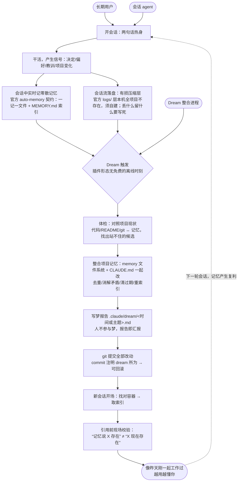

# DesignMap

## 长期目标

> **任何长期使用 Claude Code 的人，开新会话时 agent 都像昨天刚一起工作过；而且越用越懂你——记忆产生复利，agent 能连起你自己都没连起的线索。**

**验收信号**：不重复提问 · 不引用过期事实 · 与项目现状同步 · 条条可溯源 · 用户握有最终解释权。

**验收基调（周五测试总判据）**：长期用下来，用户会真切觉得"agent 更懂我和这个项目"吗？

> **缺口已补（2026-08-02）**：五条验收信号已在 [Prototype-01 TestPlan](Target-1-Consolidation/Prototype-01-FirstDream/test/TestPlan.md) 操作化为硬判据 H1–H5 与行为观察 O1–O4。其中"不重复提问"属取用段留 Target-2、"数周后复利"须长期使用验证——两条声明靶外，不算 Prototype-01 的账。

## 冲刺问题

| # | 问题                                                                                                                         | 时刻                               | 失败想象                                                                                             |
| - | ---------------------------------------------------------------------------------------------------------------------------- | ---------------------------------- | ---------------------------------------------------------------------------------------------------- |
| 1 | **过期**：记忆怎么发现自己已经错了——判据从哪来（项目现状对照？用户当场纠正？）？错删和错留，哪个代价更高，谁有权删？ | **离线整合时**（S6·S7）     | 自信引用三周前的废案，用户从此条条核实；或反过来，做梦时错删了用户反复强调过的规则                   |
| 2 | **取用**：agent 找对记忆容器、取到记忆之后，怎么知道哪条现在还成立？用错时，用户多快能发现、代价多大？                 | **运行时引用前**（S10·S11） | 记忆按路径键控，项目搬家后静默找错容器；或容器对了但引用了已经站不住的旧事实                         |
| 3 | **信任**：事后可回看、可回滚，够不够替代事前逐条批准？在什么情况下不够？                                               | 贯穿                               | 黑箱不敢开；或事事确认嫌烦关掉；或回看了但没人真的去看，错误照样存活到用户自己撞上                   |
| 4 | **所有权**：哪些文件 agent 可以自己改、哪些只能提议？边界怎么让双方都看得见、都不越界？                                | 贯穿                               | 用户明知记忆有错也不敢动，因为"这是 agent 维护的"；或 agent 改了用户认为该自己管的文件，信任瞬间破裂 |

> **1 与 2 的分界**：两者都关乎"这条记忆还成立吗"，区别在**谁在什么时刻问**——问题 1 是离线整合时的主动体检（agent 自己找出站不住的候选），问题 2 是运行时引用前的现场校验（来不及等下一次整合）。**两处都要做，但解法不同，Target 阶段不可当作同一件事投入。**

> **当前排序是 Ask the Experts 后的初步权重预判，不是定论。** 按方法论，正式排序与目标选定在 Pick a Target 阶段由 Decider 拍板。

## Map

### 角色与结果

| 角色                               | 在图上的位置                                   | 关切什么                                                    |
| ---------------------------------- | ---------------------------------------------- | ----------------------------------------------------------- |
| **长期用户**（唯一真实的人） | 起点 S1、终点 END；**梦期间不在场**      | 开会话不用重新解释；不被错误记忆坑；随时能推翻 agent 的判断 |
| **会话 agent**               | S1–S4（干活并产生信号）、S10–S11（取用记忆） | 拿到的记忆现在还成不成立；容器找对没有                      |
| **Dream 整合进程**           | S5–S9（无人值守）                             | 该删的删干净、不该删的一条不碰；改动留得下凭证              |

> **结果：开新会话时 agent 像昨天刚一起工作过；每一次自动整合的改动都可溯源、可撤销，用户握有最终解释权。**

### 数据流（会话 → 整合 → 下一轮会话，共 11 步 + 回环）

*本图是闭环而非直线：S10–S11 就是下一轮的开场，END 既是本轮结果也是下一轮 S1 的前提。「越用越懂你」这一长期目标正是靠这个回环反复叠加实现的——一轮跑通不构成价值，复利才构成。*

*两条横向批注（贯穿全流程的地基限制，不属于某一步）：*

- ***取用在架构上不被保证**——官方文档明写记忆是 context，不是 enforced configuration；S11 是运行时最后一道拦截，不是根治。*
- ***记忆容器按工作目录路径字符串键控**——项目改名/搬盘会静默孤立记忆（本项目 2026-07-29 重启搬盘时已实际发生）；S10「找对容器」因此是独立风险，不只是"取到就行"。*

### HMW（选定 8 条，2026-08-01）

| # | HMW                                                                           | 挂在 Map          | 族     | 冲刺问题 |
| - | ----------------------------------------------------------------------------- | ----------------- | ------ | -------- |
| 1 | 我们如何能让删掉一条记忆的代价，低到用户敢让 agent 自己删？                   | 步 7、步 9        | 过期   | 1        |
| 2 | 我们如何能让 agent 在用一条记忆之前，先确认它现在还成立？                     | 步 11             | 过期   | 2        |
| 6 | 我们如何能让"这条记忆已经错了"被尽早发现，而不是等用户在对话里撞上？          | 跨步 6→11        | 过期   | 1        |
| 4 | 我们如何能让每一次整合的改动，事后随时看得清、退得回？                        | 步 8、步 9        | 透明   | 3        |
| 7 | 我们如何能让用户一眼看到，agent 现在到底相信关于他和这个项目的哪些事？        | 步 8、步 10       | 透明   | 3        |
| 3 | 我们如何能让用户放心直接改动 agent 维护的记忆，而不担心破坏某种看不见的契约？ | 步 7              | 所有权 | 4        |
| 8 | 我们如何能区分"删之前必须问我"和"随手处理就好"的记忆？                        | 步 7              | 所有权 | 1、3     |
| 5 | 我们如何能让一条记忆拥有不因项目改名、搬迁而失效的身份？                      | 步 10、横向批注② | 身份   | 2        |

> **族标记是为 Pick a Target 的投票准备的。** 8 条里实际只有 4 个独立议题：过期族 3 条（1/2/6 是同一件事在不同时刻）、透明族 2 条、所有权族 2 条、身份族 1 条。**投票时若不按族看，同一件事会被投三次，权重被人为放大。**

> **来源与口径**：Ask the Experts 四模块共产出 40 条原始候选，合并去重为 21 条后选定 8 条。另剔除 2 条"整合落盘前先让用户预览或反对"类问题——与已拍板的"人不参与梦、事后报告 + 可回滚"基调直接冲突，其掌控感诉求由第 4、7 条承接。**未选中的候选未落盘**（Decider 2026-08-01 拍板），若需复查须重跑该模块。

## Target

**已拍板（2026-08-01）**：

- **target customer｜长期用户**——角色表三行中唯一真实的人。不细分处境。
- **target moment｜S6–S8 整合段**（体检 → 整合 → 梦报告）。

**圈靶依据**：8 条 HMW 中 6 条落在此段，过期/透明/所有权三族全覆盖；对齐当前权重第一的冲刺问题 1（过期）与问题 4（所有权）；官方 Auto Dream 正是在 S7 翻的车（[#47959](https://github.com/anthropics/claude-code/issues/47959) 误删 23 个记忆文件）——**机会最大、失败风险也最大**的位置。整张地图上只有这一段真正写文件、造成不可逆损失。

| 段 | 地图范围 | 定位 | 对齐冲刺问题 | 启动条件 | 档案 |
|---|---|---|---|---|---|
| **Target-1 · 整合段** | S6–S8（S4 原料层、S9 git 提交随段建设） | **主靶**：体检 + 整合 + 留证，"信任"二字的兑现处 | 1 过期（主答）、4 所有权（段内兑现）、3 信任（在此制造证据） | 即刻 | [Target-1-Consolidation/TargetMap.md](Target-1-Consolidation/TargetMap.md) |
| Target-2 · 取用段（候选） | S10–S11 | 待议：承接靶外 2 条 HMW（取用、身份） | 2 取用 | Target-1 通过后再议 | 启动时建档 |

> **本轮不圈取用段的理由**：S10–S11 依赖 S6–S8 做对。整合错了，取用侧校验再准，也只是准确地取到一条错记忆。

