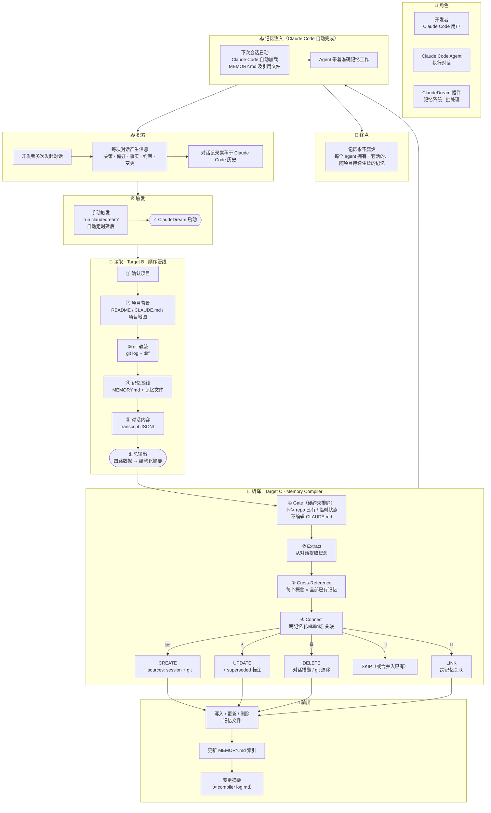

# DesignMapping — ClaudeDream

## 一、Goal

### Long-term Goal（~6 个月）

记忆永不腐烂——每个 agent 都拥有一套活的、随项目持续生长的记忆。

### Sprint Questions

1. 记忆系统真的能从一段对话中区分「值得记住的信息」和「噪音」？
2. 记忆系统真的能自我更新——对冲突覆盖、对过时淘汰、对冗余降级，而不只是追加？
3. 记忆系统真的能感知到旧记忆已被后续对话修正或推翻——而不是在新对话面前无动于衷？
4. 记忆系统真的能感知项目的变化并与项目保持同步，而不是渐渐变成一个与项目脱节的独立信息库？

## 二、Map

### HMW

> 筛选原则：每条 HMW 必须对应 Map 上一个具体节点，且来自流程走查中确认的真实难点——不凭空想象。

| # | HMW | 关联 Map |
|---|---|---|
| H1 | HMW 让 ClaudeDream 通过可靠的定时机制（loop）自动运行，用户不需要记得手动触发？ | ⏰ 触发（当前延后，仅手动） |
| H2 | HMW 让 ClaudeDream 读取并解析 Claude Code 对话历史文件（JSON 等格式），从中获取原始对话内容？ | 📖 读取 → ⑤ 对话内容 |
| H3 | HMW 让 ClaudeDream 读取 git 历史与项目文件，获取项目背景与变更轨迹供后续判定？ | 📖 读取 → ② 项目背景 · ③ git 轨迹 |
| H4 | HMW 让系统从对话素材中区分「值得记住的信息」和「噪音」？ | 🔄 编译 → ① Gate（硬约束排除）· ② Extract |
| H5 | HMW 让系统从 git 变化中识别哪些是对记忆有影响的「项目漂移」？ | 🔄 编译 → ③ Cross-Reference |
| H6 | HMW 让系统识别「用户改主意了」——新对话推翻了旧认知，而不只是「用户又说了不同的话」？ | 🔄 编译 → ⚡ UPDATE + superseded 标注 |
| H7 | HMW 给记忆引入生命周期——不重要的淡出、冲突的合并/覆盖、过时的归档、重复的去重？ | 🔄 编译 → Gate → Cross-Reference → 四分类 |
| H8 | HMW 让 ClaudeDream 执行后向用户报告变更摘要——更新了什么、为什么，让用户审阅结果？ | 📝 输出 → 变更摘要（≈ compiler log.md）|
| H9 | HMW 让写入的记忆格式既能被 Claude Code 原生高效读取，又能作为下一轮批处理的可靠比对基线？ | 📝 输出 → MEMORY.md 索引 · sources 追踪 |

### Target

> 客户：**开发者（Claude Code 用户）**。
>
> **核心 Target：C 综合判定。** 整个 ClaudeDream 的命门——四条 Sprint Question 能否答"是"，全看这一步。原型已验证通过。
>
> A 和 B 是 C 的前置支撑：没有触发就不会运行，没有输入读取就没有数据给判定用。三个 Target 的 Design Sprint 全流程（Define → Ideate → Prototype → Test → Review）已走完。

| Target | 聚焦 Map 节点 | 当前状态 | 关键产出 |
|---|---|---|---|
| **A: Loop 触发** | ⏰ 触发 | ✅ 草图完成 | 决策：手动触发，自动 loop 延后。方案草图 3 格故事板 |
| **B: 输入读取与解析** | 📖 读取 → 顺序管线 | ✅ 草图完成 | 方案：顺序 Shell 管线（5 步）。Map B/C 边界厘清。技术探路完成（transcript 格式、git 可用性、记忆路径确认）|
| **C: 综合判定** ⭐ | 🔄 编译 → Memory Compiler | ✅ 原型验证通过 | Memory Compiler 方案，对照抄 compiler compile → index → log 模型。原型四分类正确（🆕/⚡/🔁 判定与人工一致，🗑️ 逻辑覆盖）。Quality 7 rules 全通过 |
