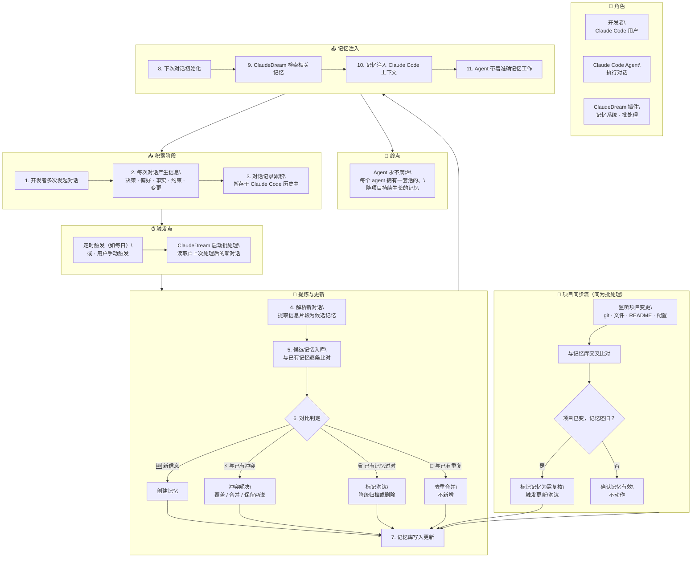

# DesignMapping — ClaudeDream

## 一、Goal + Questions

### Long-term Goal（~6 个月）

Agent 永不腐烂——每个 agent 都拥有一套活的、随项目持续生长的记忆。

### Sprint Questions

1. 记忆系统真的能从一段对话中区分「值得记住的信息」和「噪音」？
2. 记忆系统真的能自我更新——对冲突覆盖、对过时淘汰、对冗余降级，而不只是追加？
3. 记忆累积多了以后，检索质量和每次提炼的成本真的不会崩？
4. 记忆系统真的能感知项目的变化并与项目保持同步，而不是渐渐变成一个与项目脱节的独立信息库？

## 二、Map

