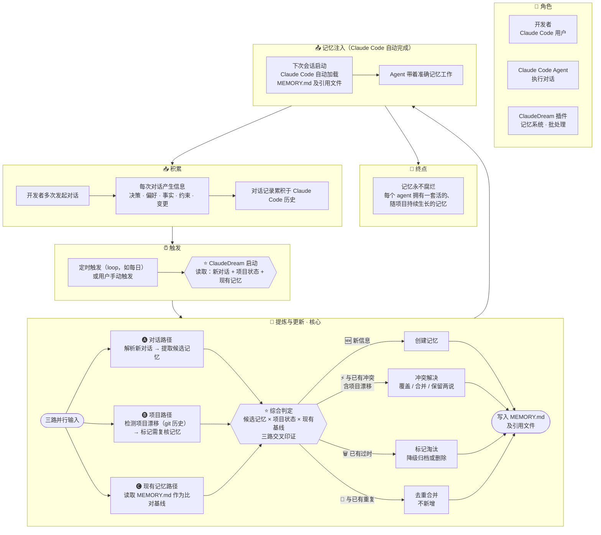

# DesignMapping — ClaudeDream

## 一、Goal

### Long-term Goal（~6 个月）

记忆永不腐烂——每个 agent 都拥有一套活的、随项目持续生长的记忆。

### Sprint Questions

1. 记忆系统真的能从一段对话中区分「值得记住的信息」和「噪音」？
2. 记忆系统真的能自我更新——对冲突覆盖、对过时淘汰、对冗余降级，而不只是追加？
3. 记忆系统真的能感知到旧记忆已被后续对话修正或推翻——而不是在新对话面前无动于衷？
4. 记忆系统真的能感知项目的变化并与项目保持同步，而不是渐渐变成一个与项目脱节的独立信息库？

## 二、Map

### HMW

> 筛选原则：每条 HMW 必须对应 Map 上一个具体节点，且来自流程走查中确认的真实难点——不凭空想象。

| # | HMW | 关联 Map |
|---|---|---|
| H1 | HMW 让 ClaudeDream 通过可靠的定时机制（loop）自动运行，用户不需要记得手动触发？ | ⏰ 触发 |
| H2 | HMW 让 ClaudeDream 读取并解析 Claude Code 对话历史文件（JSON 等格式），从中提取候选记忆素材？ | ⭐ 启动 → 🅐 对话路径 |
| H3 | HMW 让 ClaudeDream 利用 git 历史感知项目变化——不只是文件当前状态，还有变更轨迹与趋势？ | ⭐ 启动 → 🅑 项目路径 |
| H4 | HMW 让系统从对话素材中区分「值得记住的信息」和「噪音」？ | 🅐 对话路径 |
| H5 | HMW 让系统从 git 变化中识别哪些是对记忆有影响的「项目漂移」？ | 🅑 项目路径 |
| H6 | HMW 让系统识别「用户改主意了」——新对话推翻了旧认知，而不只是「用户又说了不同的话」？ | 🅒 现有记忆路径 → ⚡ 冲突解决 |
| H7 | HMW 给记忆引入生命周期——不重要的淡出、冲突的合并/覆盖、过时的归档、重复的去重？ | ⭐ 综合判定 → 四条分支 |
| H8 | HMW 让 ClaudeDream 执行后向用户报告变更摘要——更新了什么、为什么，让用户审阅结果？ | 写入 MEMORY.md |
| H9 | HMW 让写入的记忆格式既能被 Claude Code 原生高效读取，又能作为下一轮批处理的可靠比对基线？ | 写入 MEMORY.md → 🅒 现有记忆路径 |

### Target

> 客户：**开发者（Claude Code 用户）**。
>
> **核心 Target：C 综合判定。** 这是整个 ClaudeDream 的命门——Goal 的四条 Sprint Question 能否答"是"，全看这一步。必须做原型验证。
>
> A 和 B 是 C 的前置支撑：没有触发就不会运行，没有输入读取就没有数据给判定用。它们各自独立可测，但价值最终在 C 兑现。

| Target | 聚焦 Map 节点 | 原型方向 | 要回答的关键问题 |
|---|---|---|---|
| **A: Loop 触发** | ⏰ 触发 → ⭐ 启动 | 机制原型（前置） | ClaudeDream 如何被定时唤醒？Claude Code 自身 loop 能力是否足够？手动触发与自动 loop 如何共存？ |
| **B: 输入读取与解析** | ⭐ 启动 → 🅐🅑🅒 | 功能原型（前置） | 对话历史文件什么格式、怎么解析？git 历史取多深、什么算有意义的变更？三路输入能否成功汇入综合判定？ |
| **C: 综合判定** ⭐ | 🅐🅑🅒 → ⭐ 综合判定 → 四条分支 → 写入 | **算法原型（核心）** | 给定真实输入，系统能否正确区分新信息、冲突、过时、重复？判定结果能否让用户接受？四条 Sprint Question 能否答"是"？ |
