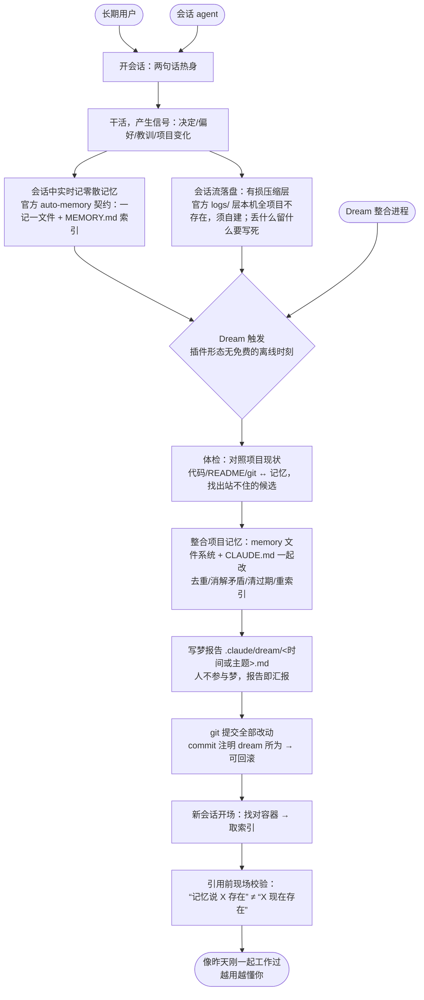

# Design Mapping

## 长期目标

**任何长期使用 Claude Code 的人，开新会话时 agent 都像昨天刚一起工作过；而且越用越懂你——记忆产生复利，agent 能连起你自己都没连起的线索。**

> 验收信号：不重复提问 · 不引用过期事实 · 与项目现状同步 · 条条可溯源 · 用户握有最终解释权。
>
> 验收基调（周五测试总判据）：长期用下来，用户会真切觉得"agent 更懂我和这个项目"吗？

## Map v1（Ask the Experts 后修订，2026-08-01）

**两条横向批注**（贯穿全流程的地基限制，不是某一步）：
- 取用在架构上不被保证——官方文档明写记忆是 context，不是 enforced configuration；S11 是运行时最后一道拦截，不是根治。
- 记忆容器按工作目录路径字符串键控——项目改名/搬盘会静默孤立记忆（本项目 2026-07-29 重启搬盘时已实际发生），S10"找对容器"因此是独立风险，不只是"取到就行"。

对比 v0 的关键改动：S4 独立成步（原料层须自建、压缩不可逆）；新增 S6（清过期必须读项目现状，不能只读记忆库自身）；新增 S8/S9（梦期间人不参与，梦改完 memory+CLAUDE.md 后写报告、用 git 提交留痕，事后可回看可回滚）；S10 强调"找对容器"（容器身份问题）；新增 S11（时效性现场校验）。

## 冲刺问题（Ask the Experts 后修订，2026-08-01）

| # | 问题 | 失败想象 | 修订理由 |
|---|---|---|---|
| 1 | **过期**（原问题 2，升首位）：记忆怎么发现自己已经错了——判据从哪来（项目现状对照？用户当场纠正？）？错删和错留，哪个代价更高，谁有权删？ | 自信引用三周前的废案，用户从此条条核实；或反过来，做梦时错删了用户反复强调过的规则 | 三套前人方案（compiler / auto-dream / claude-dream）里，compiler 完全没处理删除/过期；官方 auto-dream 只覆盖"与代码矛盾"一种判据；且官方已实测出"错删"事故（24 小时内静默删 23 个记忆文件），证明"过度遗忘"和"遗忘不足"是同一问题的两面，不只是原问法暗示的"该忘的没忘" |
| 2 | **取用**（原问题 1，改窄）：agent 找对记忆容器、取到记忆之后，怎么知道哪条现在还成立？用错时，用户多快能发现、代价多大？ | 记忆按路径键控，项目搬家后静默找错容器；或容器对了但引用了已经站不住的旧事实 | "记忆被注入"这件事已被验证可行三遍（compiler 的 SessionStart hook、官方 MEMORY.md 默认注入、用户自己的 README 地图）；真正没解决的是"用旧用错"。且官方文档明写记忆是 context 不是 enforced configuration，不保证被遵循——这是架构天花板，不是我们能修的 |
| 3 | **信任**（原问题 3，改问法）：事后可回看、可回滚，够不够替代事前逐条批准？在什么情况下不够？ | 黑箱不敢开；或事事确认嫌烦关掉；或回看了但没人真的去看，错误照样存活到用户自己撞上 | 原问法预设"事前逐条审查"，但两套前人实现都不做事前审查，且事前审查与"开新会话两句话进入状态"的低负担长期目标冲突；本项目自己已经在用 git 免费获得可溯源/可撤销，问题应聚焦"这够不够、缺口在哪" |
| 4 | **所有权**（新增）：哪些文件 agent 可以自己改、哪些只能提议？边界怎么让双方都看得见、都不越界？ | 用户明知记忆有错也不敢动，因为"这是 agent 维护的"；或 agent 改了用户认为该自己管的文件，信任瞬间破裂 | 决策者访谈核心痛点——不敢碰 agent 维护的记忆文件，腐烂因此持续；compiler（"LLM 全权拥有，人很少编辑"）与官方 auto-dream（"绝不碰人写的 CLAUDE.md"）给出两个相反答案，原三问都没问到这条，而它正是"势力范围：整合记忆文件与 CLAUDE.md"这一定义本身的前提 |

> 排序即当前权重（1 最重）。POV+HMW 已随 Ask the Experts 一并完成发散，见下方 HMW 表；下一阶段是 Target。

## HMW（选定，2026-08-01）

| # | HMW | 挂在 Map | 冲刺问题 | 入选理由 |
|---|---|---|---|---|
| 1 | 我们如何能让删掉一条记忆的代价，低到用户敢让 agent 自己删？ | S7·S9 | 1 过期 | 直击决策者的成功判据（错误记忆被自动清掉）；是官方 23 文件误删事故的正面解法 |
| 2 | 我们如何能让 agent 在用一条记忆之前，先确认它现在还成立？ | S11 | 2 取用 | 运行时最后一道拦截，比等下一次整合来清理更早生效 |
| 3 | 我们如何能让用户放心直接改动 agent 维护的记忆，而不担心破坏某种看不见的契约？ | S7 | 4 所有权 | 决策者亲述痛点；claude-memory-compiler（LLM 全权拥有）与官方 auto-dream（绝不碰人写的文件）给出相反答案，此处必须自己定 |
| 4 | 我们如何能让每一次整合的改动，事后随时看得清、退得回？ | S8·S9 | 3 信任 | 官方三缺口（身份/准确性/透明度）的直接解药；是已拍板设计"梦报告 + git 提交"的核心命题 |
| 5 | 我们如何能让一条记忆拥有不因项目改名、搬迁而失效的身份？ | S10·批注② | 2 取用 | 本项目 2026-07-29 搬盘时自己踩过；官方按路径字符串键控且未意识到此问题——差异化定位②的入口 |
| 6 | 我们如何能让"这条记忆已经错了"被尽早发现，而不是等用户在对话里撞上？ | S6·S11 | 1 过期 | 决策者失败想象的原句；三套前人方案无一给出完整答案 |
| 7 | 我们如何能让用户一眼看到，agent 现在到底相信关于他和这个项目的哪些事？ | S8·S10 | 3 信任 | 信任应建立在"看得懂它做了什么"而非"相信它不会做错"；是梦报告的设计入口 |
| 8 | 我们如何能区分"删之前必须问我"和"随手处理就好"的记忆？ | S7 | 1·3 | "人不参与梦"这一激进设计的安全阀 |

> 来源与口径：Ask the Experts 四模块（A 官方机制+项目考古 / B 前人方案深读 / C 社区之声调研 / D 决策者访谈）共产出 40 条原始候选，合并去重为 21 条后选定其中 8 条。另剔除 2 条"整合落盘前先让用户预览或反对"类问题——与已拍板的"人不参与梦、事后报告 + 可回滚"基调直接冲突，其掌控感诉求由第 4、7 条承接。未选中的候选不再落盘。
