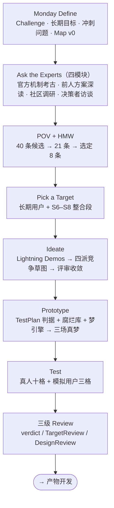

# DesignReview · ClaudeDream 设计冲刺总结算

**结算日**：2026-08-02　**Decider**：seapawn　**方法**：IDEO 设计思维五模式 + Jake Knapp Design Sprint

> **这是 `.IDEO` 的总入口。** 只想知道结论的人，读第 0 节就够。

## 0. 一分钟版

**我们问的是什么**：长期使用 Claude Code 的人，记忆会腐烂——agent 自信引用三周前的废案，用户从此条条核实。官方有自动整合（Auto Dream），但它零留证、禁碰 CLAUDE.md，且在社区出过 24 小时静默删除 23 个记忆文件的事故。我们要造的是**可信的记忆离线整合**：体检 → 整合 → 留证。

**我们答出了什么**：一个能在真实腐烂记忆库上**真跑通**的"梦"——它删对了该删的、一条健康记忆没碰、改了官方明令不许碰的 CLAUDE.md（因为有阀门和回滚层）、写了份四个人都读完的报告、还连出一条用户自己没连起的线。

**结论一句话**：**Target-1 带条件通过；设计冲刺在此结束，转产物开发。**

**三个最值钱的产出**：

| 产出 | 在哪 |
|---|---|
| 定稿方案——判据 M1–M5/S1–S3、L0–L3 权限模型、三道安全阀、报告六节 | [Sketches.md](Target-1-Consolidation/Prototype-01-FirstDream/Sketches.md) |
| 真跑通的第一场梦（可复现的原型 + 三场真产物） | [Prototype-01-FirstDream/](Target-1-Consolidation/Prototype-01-FirstDream/) |
| 七条改造清单（产物开发的入场条件） | [verdict.md](Target-1-Consolidation/Prototype-01-FirstDream/verdict.md) §3 |

**三个最值钱的教训**（都是反直觉的）：

1. **撤销键的工程质量必须高于删除键。** 我们把大量心思花在"怎么安全地删"（铁律、熔断、隔离优先），却让回滚停留在"报告里贴一行 git 命令"——审计型用户一眼看穿：所谓"单条回滚"做不到单条隔离，撤一笔会静默丢掉另一笔。**一个把"我删过你东西"当卖点的工具，它的撤销键不该比删除键更粗糙。**
2. **模拟用户测出的缺陷远多于真人。** 不是 LLM 比人聪明，是**人格约束逼出了真人不会采取的视角**——真人是共同设计者，看什么都顺眼；被要求"逐笔核对"的审计人格，就真的去 diff 里抠 hunk 头，核出十条结构性缺陷且条条属实。
3. **安全阀只能用故障注入证明。** 我们把熔断线压到 1 想看它触发，结果真 agent 读到线之后自觉只删一条——**合作型 agent 永远碰不到工程熔断线**。必须写一个"作恶假 agent"顶替它走完真实审计路径，三种作案才全被拦下。

**去哪儿看什么**：见第 8 节档案地图。

## 1. 长期目标结算

> **长期目标原句**：任何长期使用 Claude Code 的人，开新会话时 agent 都像昨天刚一起工作过；而且越用越懂你——记忆产生复利，agent 能连起你自己都没连起的线索。

这句话是**两个承诺**，必须分开裁：

**项目侧（"像昨天刚一起工作过"）—— 证成。** 真人被试走完全程后的原话是"**更懂我们的项目了**"。四位被试（含三个模拟人格）都能从报告理解 agent 现在相信关于这个项目的哪些事；腐烂条目被清、CLAUDE.md 与现状对齐，都是这一侧的实证。

**个人侧（"越用越懂你"、"连起你自己都没连起的线索"）—— 部分证成。**
- **机制存在且有效**：connection 真跑产出，三位模拟用户判"干货"——P2"全场唯一的干货……其余都是它在汇报自己的家务，那是成本不是收益"；P3"唯一让我觉得它在帮我而不是替我做主的东西"。**R1（废连接毁信任）不成立，wiki 层保留。**
- **但"懂你"侧未测**：真人自发说的是"更懂我们的项目"，没说"更懂我"。本轮剧本几乎没行使 user/feedback 类记忆（只在 G9 露了一面），且用户裁决送回下一梦的回程还没接通。**这是"未测"不是"失败"** —— 须待 S4 底片层接通、并设计跨周的长期使用剧本才能判。

## 2. 五条验收信号逐条结算

| 验收信号 | 本轮操作化 | 结果 | 缺口 |
|---|---|---|---|
| 不引用过期事实 | H1 查全：5 条种植腐烂全处置，对答案卡对账 | ✅ **过** | M4 的"搭便车事实"盲区（实体死 ≠ 记忆里所有事实都死） |
| 与项目现状同步 | H2 查准：36 条健康记忆零误删 + CLAUDE.md 恰改种植行 | ✅ **过** | — |
| 条条可溯源 | H3：报告每笔四要素 + 抽查点执行即复现 | ⚠️ **形式过、实质待改** | 证据是转述非执行日志（C2）；抽查点有一条永不失败（C3） |
| 用户握有最终解释权 | H4：单条回滚 + 关阀降级 + 熔断中止实测 | ⚠️ **部分过** | 单条回滚跨笔连坐会静默丢数据（C1） |
| 不重复提问 | **声明靶外**——属取用段 S10–S11 | ⬜ **未测** | 转 Target-2 |

**诚实标注**：五条里两条打折、一条未测。打折的两条恰好都在"信任"这个主承诺上，且**都不是执行不力，是判据当初写得太松**——H3 只要求"抽查点能执行"，没要求"证据本身是执行产物"。这个漏洞被审计人格撞破，这正是 Test 的价值。

## 3. 四条冲刺问题的答案

**问题 1 · 过期**（权重第一，主答在 Target-1）
- *判据从哪来* → 项目现状 + git 讣告。机械层五判据零 LLM 成本先跑，M4 用 `git log --diff-filter=D` 把"0 命中"升级为"确凿"；
- *错删和错留哪个代价更高* → **错删远高**，已落成结构：隔离优先、feedback 类永不自动删、拿不准一律 quarantine；
- *谁有权删* → **机械证据开票、LLM 无票、引擎执行**。梦 agent 在结构上没有删除能力，只能提交申请单，引擎逐笔校验后代为执行，非法申请整梦回滚。
- *未尽处*：M4 判据的搭便车事实盲区。

**问题 4 · 所有权**
边界靠三件套划定：阀门（默认改 CLAUDE.md、可关）+ L0–L3 分级处置 + 势力范围声明。实证两处：真人关阀后判"就应该如此"；**两场真梦都主动认边界**——发现 `jest.config.cjs` 是矛盾定谳的钥匙，但都判定"删代码文件超出我势力范围"，转而请用户动手。*未尽处*：P3 提出的 observe-only 模式（"不是降级，是功能不同的产品——把插件从处置人变成导游"）待裁。

**问题 3 · 信任**（本次冲刺最重要的发现所在）
四位被试给出**四种不同态度**：真人"更懂我们的项目了"、审计型"观察期"、赶时间型"有条件允许"、新接手型"先只报告"。这个分歧本身就是答案——

> **"事后回看能否替代事前批准"，取决于回看的可查证性。**
> 报告告诉了用户它做了什么，但没让用户能**查证**它做了什么。前者是产品，后者才是信任。

四人里唯一真去核的（审计型）核完的结论是"内部一致，但外部证据一条都验不成"；另外三人根本没核——**日常没人会核，起疑时才核；所以抽查点平时的价值是"存在即安心"，但正因如此，它必须经得起真查。** 今天经不起。

**问题 2 · 取用** —— 整条靶外，转 Target-2。其前提（整合先做对）现已具备。

## 4. 走了什么路

| 阶段 | 产出了什么 |
|---|---|
| Define | [ChallengeBackground.md](ChallengeBackground.md)、[DesignMap.md](DesignMap.md) |
| Ask the Experts | 上述两份补全（官方双层机制、两起社区事故、前人三条路径、差异化定位） |
| POV + HMW | DesignMap 的 8 条 HMW（含族标记） |
| Pick a Target | [Target-1-Consolidation/TargetMap.md](Target-1-Consolidation/TargetMap.md) |
| Ideate | [IdeaPool.md](Target-1-Consolidation/Ideate/IdeaPool.md)（14 条弹药）、[SketchPool.md](Target-1-Consolidation/Ideate/SketchPool.md)（四派草图）、[Sketches.md](Target-1-Consolidation/Prototype-01-FirstDream/Sketches.md)（杂交定稿） |
| Prototype | [Storyboard.md](Target-1-Consolidation/Prototype-01-FirstDream/Storyboard.md)（双侧）、`testbed/` `engine/` `artifacts/`、[TestPlan.md](Target-1-Consolidation/Prototype-01-FirstDream/test/TestPlan.md) |
| Test | `test/` 四份记录 |
| Review | [verdict.md](Target-1-Consolidation/Prototype-01-FirstDream/verdict.md)、[TargetReview.md](Target-1-Consolidation/TargetReview.md)、本文件 |

**一段叙事**：这次冲刺的转折点有三个。第一个是 **Pick a Target** ——把靶圈在"整合段"而非全流程，因为整张地图上只有这一段真正写文件、造成不可逆损失，机会与风险都最大。第二个是 **Ideate 收敛**——四派草图独立竞争后，Decider 选 wiki 派为主体并嫁接其余三派九项，理由是四份里只有它兑现了"复利"（connection 让整合从只做减法变成也做加法）。第三个是 **Test 的模拟用户环节**——它把一份"施工验收全过"的成绩单撕开了三道口子，而这三道口子恰好全在"信任"上。

## 5. 11 步 Map 的覆盖账

| 步骤 | 状态 |
|---|---|
| S1–S3 开会话 / 干活 / 实时记忆 | **官方现成**（auto-memory），本轮沿用其存储契约不改 |
| S4 会话流落盘 | **已拍板未动工**——取 A 机械压缩底片层（Karpathy `raw/` 形制），进产物 backlog |
| S5 Dream 触发 | **本轮建设**（原型级：手动触发近似；SessionEnd hook + 冷却期留产物阶段） |
| **S6 体检** | **本轮建设**——M1–M5 机械层 + S1–S3 语义层，真跑验证 |
| **S7 整合** | **本轮建设**——L0–L3 权限模型 + 三道安全阀，故障注入验证 |
| **S8 留证** | **本轮建设**——报告六节，四人读完；证据形态待改（C2/C3） |
| S9 git 提交 | **本轮建设**——快照 + `dream:` 单提交 = 回滚原子 |
| S10–S11 取用与现场校验 | **靶外**，转 Target-2 |

## 6. 方法论收获（可复用于下一次冲刺）

1. **真人测体验，模拟用户测缺陷。** 真人给的是"用起来什么感觉"，模拟人格给的是"哪里站不住"。两者不可互相替代，且成本相差一个量级。
2. **真人被试的偏倚必须显式记账。** 本次真人是共同设计者且测前听过实现讲解——他的"点赞"证据力低于他的"追问"证据力（那句"你读了我们的对话吗"直接引出了 S4 拍板）。
3. **布景数据必须从真产物机器提取，不可手写。** 主持人手写测试道具时抄错了两个数，被审计人格当场抓住并扣信任分——这与我们给产品开的 C5 改造（提示行必须与报告同源生成）是同一条原则的两面。
4. **安全阀只能用故障注入证明**（见第 0 节教训 3）。建议进产物 CI。
5. **白板产物走 plan-view 逐段批注**：定稿全文先进 plan、Decider 在审批界面逐段批注、按批注改完再落盘。多次"拒绝审批"其实是深挖信号而非否定。
6. **四派竞争草图 + 杂交定稿**：让三个 subagent 在真隔离下各画一派、主 agent 亲画一派，再由 Decider 选主体并嫁接。比"一稿反复改"更容易暴露方案的结构性差异。

## 7. 去向

**① 产物开发（Scrum 段）的入场条件**：
- [verdict.md](Target-1-Consolidation/Prototype-01-FirstDream/verdict.md) §3 的 C1–C7 七条改造（**C1/C2/C3 是"信任"承诺的兑现前提，须在首个可用版本前完成**）；
- S4 机械压缩底片层（含用户裁决回程修复）；
- Agent SDK `canUseTool` 结构缴械——原型实测发现 `.claude` 是受保护路径、headless 下 hook 不加载，这条从"推荐"升级为"必选"。

**② Target-2 · 取用段（S10–S11）**：承接靶外 2 条 HMW 与冲刺问题 2；其前提（整合先做对）现已具备。

**③ 待 Decider 另裁三项**：observe-only 模式是否进产物 / 梦间方差是否可接受 / 个人侧复利怎么测。三项均在 verdict.md §4 有完整论据。

## 8. 档案地图

| 文件 | 用途 |
|---|---|
| **DesignReview.md**（本文件） | 冲刺总结算——**总入口** |
| [ChallengeBackground.md](ChallengeBackground.md) | 挑战宣言、势力范围与非目标、官方现状与社区事故、前人方案对比、差异化定位 |
| [DesignMap.md](DesignMap.md) | 长期目标与验收信号、4 条冲刺问题、角色与结果、11 步数据流地图、8 条 HMW、Target 总表 |
| [Target-1-Consolidation/](Target-1-Consolidation/) | **主靶全部档案**——靶定义（TargetMap）、结算（TargetReview）、Ideate 弹药与草图、原型与测试 |
| [../reference/](../reference/) | 外部方案原料（auto-dream · auto-memory · claude-memory-compiler · claude-code-log · claude-mem · claude-dream） |

**效力顺序**：`reference/` 原料 > `.IDEO/` 蒸馏（冲突时以原料为准）；本文件是蒸馏层的总入口，但具体结论以各层 Review 与 Map 为准；已被替代的旧状态只从 Git 历史追溯，不堆回文档。
