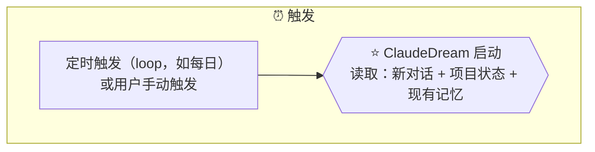

# Target A: Loop 触发 — TargetMapping

## 一、Target Goal

验证 ClaudeDream 的定时触发机制能否可靠运行。

### 关键问题

- ClaudeDream 如何被定时唤醒？
- Claude Code 自身 loop 能力是否足够？
- 手动触发与自动 loop 如何共存？

## 二、关联 Map & HMW

### Map 关联

Focus: ⏰ 触发 → ⭐ 启动

### HMW 关联

| # | HMW | 关联 Map |
|---|---|---|
| H1 | HMW 让 ClaudeDream 通过可靠的定时机制（loop）自动运行，用户不需要记得手动触发？ | ⏰ 触发 |

## 三、方案草图（2026-07-18）

**当前阶段**：自动 loop 延后，退化为手动触发。

**标题：ClaudeDream 手动入口**

| 格1：用户发起 | 格2：确认启动 | 格3：交接下游 |
|---|---|---|
| 你说 "run claudedream" | 我收到指令，确认要跑 | 通知下游开始：读取输入 → 综合判定 → 写入 → 报告 |
| → 意图明确：启动记忆整理 | → 环境准备就绪 | → 后续由 B/C 负责 |

**验证目标**：手动触发路径能否成功启动并将控制权交给下游。

**不涉及**：输入读取（B）、综合判定（C）、记忆写入（C）。
