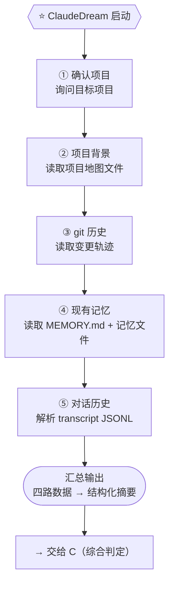

# Target B: 输入读取与解析 — TargetMapping

## 一、Target Goal

验证顺序管线能否成功完成四路读取并汇入综合判定。

### 关键问题

- 项目背景文件（README、CLAUDE.md）从哪读、读哪些？
- git 历史取多深、什么算有意义的变更？
- 对话历史（transcript JSONL）如何解析——哪些字段有意义？
- 现有记忆能否稳定读取为基线？
- 四路输出结构是否足以让 C 开始工作（不需要自己翻原始数据）？

## 二、关联 Map & HMW

### Map 关联

Focus: ⭐ 启动 → 顺序管线读取

> **顺序逻辑**：项目背景 → git 轨迹 → 已有记忆 → 新对话，是从"在哪"到"发生了什么"到"已知什么"到"新出现了什么"的递进。

### HMW 关联

| # | HMW | 关联 Map |
|---|---|---|
| H2 | HMW 让 ClaudeDream 读取并解析 Claude Code 对话历史文件（JSON 等格式），从中获取原始对话内容？ | ⭐ 启动 → ⑤ 对话历史 |
| H3 | HMW 让 ClaudeDream 读取 git 历史与项目文件，获取项目背景与变更轨迹供后续判定？ | ⭐ 启动 → ② 项目背景 · ③ git 历史 |

## 三、方案草图（2026-07-18）

**当前阶段**：方案选定——顺序 Shell 管线。先确认项目 → 项目背景 → git → 现有记忆 → 对话历史 → 汇总交给 C。

**标题：ClaudeDream 输入读取管线**

| 格1：触发 & 确认 | 格2：顺序读取 | 格3：交接下游 |
|---|---|---|
| A 触发后，先问"更新哪个项目？" → 确认目标项目 | ① 读项目地图 → ② git log + diff → ③ 读 MEMORY.md + 记忆文件 → ④ 解析 transcript JSONL | 四路数据汇总为结构化摘要 → 交给 C（综合判定） |
| → 用户指定项目目录 | → 输出：项目背景 · 变更轨迹 · 记忆基线 · 对话内容 | → C 基于此做判定：新/冲突/过时/重复 |

**验证目标**：四路数据是否都成功取出？输出格式是否足以让 C 开始工作？

**不涉及**：判定（C）、记忆写入（C）、自动定时（A）。
