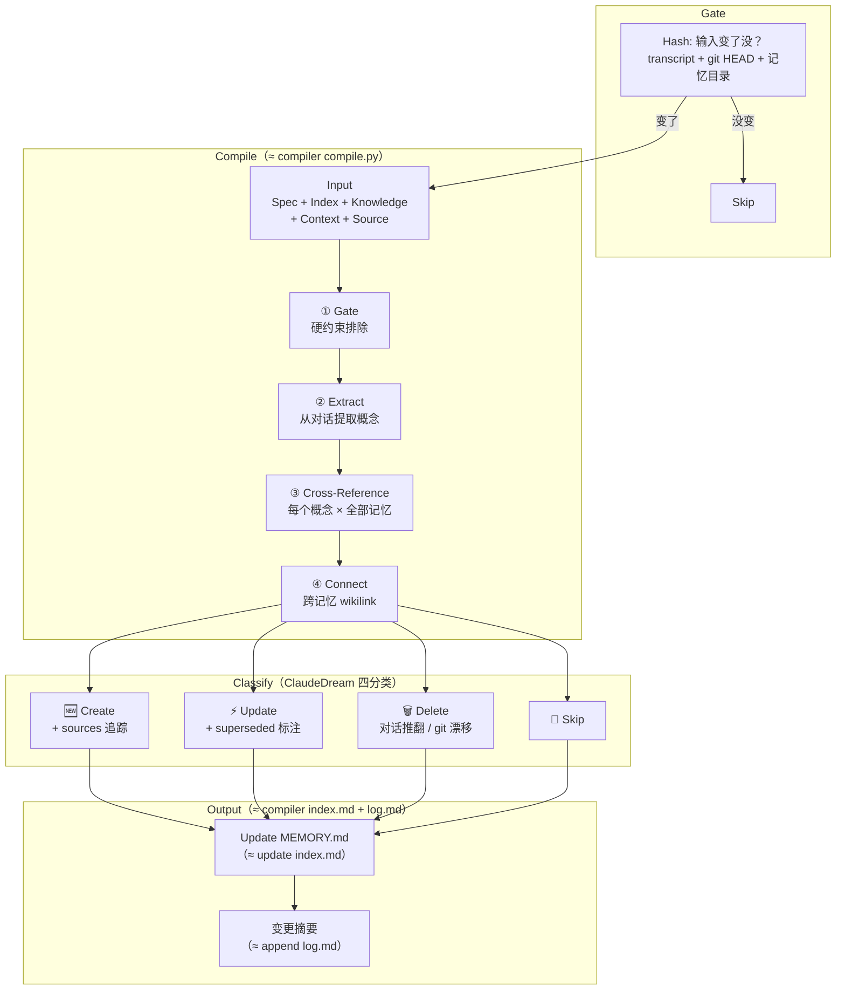

# Target C: 综合判定 — TargetMapping

## 一、Target Goal

验证 Memory Compiler 能否正确区分新信息、冲突、过时、重复，并完成与 compiler 对标的完整流程（全量上下文 → 提取 → 交叉印证 → 分类 → 写入 → 变更摘要）。这是整个 ClaudeDream 的命门。

### Sprint Questions

1. 记忆系统真的能从一段对话中区分「值得记住的信息」和「噪音」？
2. 记忆系统真的能自我更新——对冲突覆盖、对过时淘汰、对冗余降级，而不只是追加？
3. 记忆系统真的能感知到旧记忆已被后续对话修正或推翻——而不是在新对话面前无动于衷？
4. 记忆系统真的能感知项目的变化并与项目保持同步，而不是渐渐变成一个与项目脱节的独立信息库？

### 关键问题

- 给定真实输入，系统能否正确区分新信息、冲突、过时、重复？
- 判定结果能否让用户接受？
- 四条 Sprint Question 能否答"是"？

## 二、关联 Map & HMW

### Map 关联

Focus: Gate → Compile（≈ compiler compile.py）→ Classify（四分类）→ Output（≈ compiler index.md + log.md）

> **流程说明**：
> - Gate：确定性层——Hash 检查输入是否变化。
> - Compile：语义层——①硬约束排除 → ②Extract 提取概念 → ③Cross-Reference 交叉印证 → ④Connect 跨记忆关联。
> - Classify：四分类执行。
> - Output：更新 MEMORY.md + 变更摘要。

### HMW 关联

| # | HMW | 关联 Map |
|---|---|---|
| H4 | HMW 让系统从对话素材中区分「值得记住的信息」和「噪音」？ | ② Extract |
| H5 | HMW 让系统从 git 变化中识别哪些是对记忆有影响的「项目漂移」？ | ③ Cross-Reference · git 漂移 |
| H6 | HMW 让系统识别「用户改主意了」——新对话推翻了旧认知，而不只是「用户又说了不同的话」？ | ⚡ Update superseded 标注 |
| H7 | HMW 给记忆引入生命周期——不重要的淡出、冲突的合并/覆盖、过时的归档、重复的去重？ | Gate → Compile → Classify → Output |
| H8 | HMW 让 ClaudeDream 执行后向用户报告变更摘要——更新了什么、为什么，让用户审阅结果？ | 变更摘要（≈ compiler log.md） |
| H9 | HMW 让写入的记忆格式既能被 Claude Code 原生高效读取，又能作为下一轮批处理的可靠比对基线？ | Output · Update MEMORY.md |

## 三、方案草图（2026-07-18）

**当前阶段**：方案选定——Memory Compiler。照抄 compiler 的 wiki 编译模型（compile → index → log），融入 ClaudeDream 原创的 git 漂移感知。

**标题：ClaudeDream Memory Compiler**

| 格1：Gate & Orient | 格2：Compile | 格3：Finalize |
|---|---|---|
| Hash 检查输入变了没。没变→跳过。变了→读入全部记忆 + 项目状态 + 对话 | 硬约束排除 → 提取概念 → 每个概念 × 全部记忆交叉印证 → 四分类（新/冲突/过时/重复）→ 跨记忆 wikilink 关联 | 写入记忆文件 + 更新 MEMORY.md + 输出变更摘要 |
| → 对标 compiler gate + 全量上下文 | → 对标 compiler wiki 编译 + ClaudeDream 原创 git 漂移 | → 对标 compiler index.md + log.md |

**验证目标**：分类是否正确？来源是否追踪？冲突是否合理标注？摘要是否清晰？

**不涉及**：自动定时（A）、输入读取（B）、lint 健康检查（延后）、hooks 自动化（延后）。
