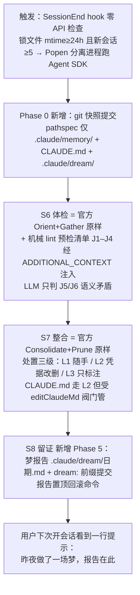
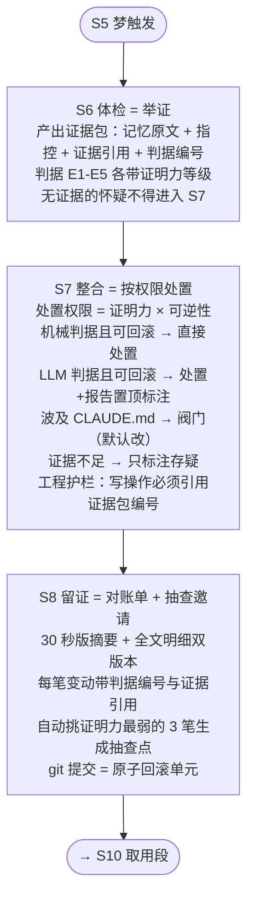
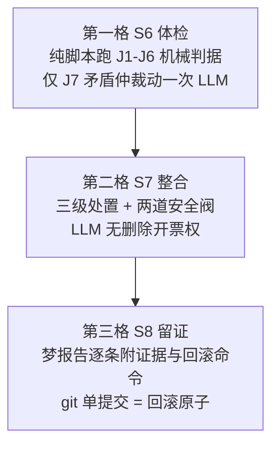
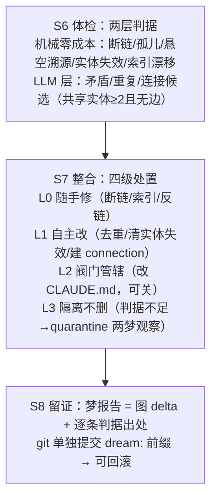

# SketchPool · Target-1 四份竞争草图

**这是什么**：Ideate 第二步 Sketch（2026-08-02）产出——四位 sketcher 按四种性格独立作画（互相不可见），每份都是完整的 S6→S8 整合段方案，固定五节：Crazy 8s 变体、三格故事板、实物样例、自报风险、弹药引用。A/C/D 由隔离 subagent 画（真匿名），B 由主 agent 亲画（非匿名，评审时注意校准）。

**效力**：四份均为竞争候选，**未经评审、无一拍板**；评审收敛（静默评审 → Decider 选定或杂交）是下一步。主 agent 收卷验收已过：五节齐全、三件事全答、硬约束无违例；D 声明突破反面清单第 3 条，理由在卷。弹药引用的 #号指 [IdeaPool.md](IdeaPool.md)。

---

# Sketch-A · 官方改良派

## 1. Crazy 8s

1. 纯最小版：官方四阶段一字不改，只在末尾加一个 git commit。
2. 前后双快照：梦前 checkpoint 提交 + 梦后提交，`git diff` 本身就是报告。
3. 机械预检外挂：官方提示词不动，用零成本 lint 生成"体检候选清单"，从 ADDITIONAL_CONTEXT 注入点喂进去。
4. 阀门版：官方 Phase 4 的"do NOT edit CLAUDE.md"红线改成用户可关的阀门——默认改，关了退回官方式"标注+汇报"。
5. 报告即 commit：不写独立报告文件，全部凭证写进 commit message body。
6. 处置三级化：官方"deleting contradicted facts"一句话细分为"随手处理 / 凭证据改删 / 只标注"三级通道。
7. 触发复刻：照抄官方 24h+5 会话+锁文件 mtime 门控，由 SessionEnd hook + 分离进程模拟被 gate 锁死的官方机制。
8. summary 升格：官方会话内一句话 summary 用同一模板落盘成 `.claude/dream/*.md` 梦报告。

**选 4 号展开**：阀门是 Decider 已定向、官方明确不做而我们必须做的唯一一处原则性偏离——其余 7 个变体（2/3/6/7/8）都是它的配件，可全部吸收进主干而不增加任何新原则。

## 2. 三格故事板



**第一格 S6 体检——判据清单**（外部现实是唯一裁判，不拿记忆互相投票）：
- J1 实体存在性（机械）：记忆引用的文件/目录/命令/flag 现在还存在吗；
- J2 路径漂移（机械）：记忆记录的项目路径、包管理器、分支名与现状不符；
- J3 索引健康（机械）：MEMORY.md 指针断链、孤儿记忆文件、索引行超 150 字符；
- J4 相对日期（机械）：含"昨天/上周"未转绝对日期；
- J5 现实矛盾（LLM）：记忆断言 ↔ 当前代码库/README/git log 事实相反，须引出证据行；
- J6 记忆互矛盾（LLM）：两条记忆打架，按 git 时间序 + J5 现实核验裁决，不许投票。
J1–J4 纯文件 I/O 零成本先跑，产出候选清单注入提示词；LLM 预算只花在 J5/J6。

**第二格 S7 整合——谁有权删**：
- L1 随手处理：J3/J4 类不涉事实真伪的（修断链、转日期、合并重复）——直接做，报告列账；
- L2 凭证据改删：J1/J2/J5 有外部现实证据的——删或改，每条必须附证据出处；
- L3 只标注不动：feedback 类（用户亲口纠正过的）、team/ 记忆、查无实据的——标注后进报告"待你裁决"节。官方不对称成本原则原样保留：拿不准就留。
- **阀门**：CLAUDE.md 修改属 L2，但受 `editClaudeMd` 阀门管；权限在配置层缴械——dream agent 工具白名单只有 Read/Grep/Glob/Write(限记忆目录+CLAUDE.md+dream/)/Bash(仅 git)。

**第三格 S8 留证——凭证三件**：梦报告全文（见下）＋ `dream:` 前缀独立提交（Phase 0 快照保证它不混入用户改动）＋ 报告置顶一行回滚命令。

## 3. 实物样例

**场景**：项目 shoreline 三周前从 npm 迁到 pnpm、删除 `src/api/legacy.ts`、CLAUDE.md 改为"缩进 2 空格"。记忆库仍留着旧事实。梦报告 `.claude/dream/2026-08-02-0341.md` 全文：

```markdown
# 梦报告 · 2026-08-02 03:41
触发：距上次整合 26h，新会话 6 个。回滚整场梦：`git revert a3f9c12`
阀门状态：editClaudeMd = on（改动见 §1；关闭方法见报告尾）

## 1. CLAUDE.md 改动（阀门开启，已直接修改）
- 「构建：npm run build」→「构建：pnpm build」
  证据：package.json 含 "packageManager":"pnpm@9.1"；git log 2026-07-11 "migrate to pnpm"。

## 2. 删除 2 条（凭证据，L2）
- test-command.md「测试跑 npm test」— J2 路径漂移：仓库无 package-lock.json，
  有 pnpm-lock.yaml。
- legacy-api-quirks.md「legacy.ts 的日期解析有坑」— J1 实体不存在：
  src/api/legacy.ts 已删（git log 2026-07-15）。

## 3. 随手处理 3 项（L1）
- MEMORY.md 移除上述 2 条断链指针；合并 2 条重复的 pnpm 笔记；
  「上周决定的缓存策略」→「2026-07-24 决定」。

## 4. 待你裁决 1 条（L3，未动）
- indent-tabs.md（feedback 类：你 07-05 亲口说"用 tab"）与 CLAUDE.md 07-20
  "缩进 2 空格"矛盾。用户纠正类记忆不自动删——请裁决，改哪边我下场梦执行。

## 5. 未动：team/ 全部 4 条；其余 9 条记忆体检通过。
```

**判据可执行描述**：J1 = 对每条记忆正则提取路径/命令 token，`test -e` 与 `git grep -l` 核验；J2 = 锁文件/配置指纹对照（package-lock vs pnpm-lock 类）；J3 = 解析 MEMORY.md 链接逐一 stat + 反向找孤儿；J4 = 相对时间词正则。四项零 LLM，输出候选清单；J5/J6 由 dream agent 对着候选与现状判，删必引证。

**阀门用户所见**——`.claude/settings.json`：

```json
{ "claudeDream": { "enabled": true, "editClaudeMd": true } }
```

`editClaudeMd: false` 时降级为官方原版行为：CLAUDE.md 一字不动，冲突记忆加注 "contradicts CLAUDE.md — verify which is current"，报告 §1 变为「CLAUDE.md 修改建议（未执行）」并附可直接粘贴的 diff。每份报告尾行固定打印当前阀门状态，用户永远看得见开关在哪。

## 4. 自报风险

1. **J5/J6 仍是提示词自觉**：机械判据只护住了 J1–J4，语义误删（#47959 式）在 L2 通道里依然可能发生；全部赌注押在 git revert 上——若用户从不看报告（冲刺问题 3 的失败想象），错误照样活到被撞上。
2. **触发机制未经实战**：SessionEnd hook + Popen 分离进程在 Windows 下的可靠性、分离进程复用本地凭据的额度与合规性，全部只有 compiler 一个孤证（IdeaPool #14），没有第二实现佐证。
3. **"最小差异"的反噬**：若官方 gate 明天放行 auto-dream，本插件与官方 dream 会双写同一记忆目录、争抢 `.consolidate-lock`，届时"贴着官方"从优点变成冲突源。

## 5. 弹药引用

- 判据：#1（外部现实当判据）、#2（存在性可机械核验）、#3（机械打底 LLM 只判矛盾）；
- 所有权：#4（不对称成本安全阀）、#5（CLAUDE.md 阀门，Decider 定向）、#6（权限配置层缴械）、#8（分级即处置）；
- 留证：#9（快照+溯源+日志三件套的 git 版）、#11（索引即摘要，报告模板沿用一行一钩子）；
- 基建：#13（官方机械压缩 S4 路线原样沿用）、#14（无免费离线时刻的实证绕法，触发机制全靠它）。
- 反面清单：一条未破。突破官方"do NOT edit CLAUDE.md"红线不在反面清单内，系 Decider 已拍板的差异化定位，凭 Phase 0 快照 + 独立提交的回滚层兑现。

---

# Sketch-B · 审计派（主 agent 亲画，非匿名）

## 1. Crazy 8s

1. **判决书模型**：每笔处置写成五要素判决——事实、证据、判据、处置、上诉方式；报告即判决书汇编。
2. **双录模型**：给人看的报告 + 机器可回放的操作日志双轨，报告每句可展开到底层操作。
3. **对账单模型**：报告长得像银行对账单——期初余额、变动明细（每笔带凭证号）、期末余额，一眼看出少了什么。
4. **证据链倒置**：先强制收集证据，证据不足的记忆一律不许动——无证不删。
5. **双版本报告**：30 秒版（只讲敏感改动与撤销方式）+ 全文版，专为"没人真的去看报告"设计。
6. **git 原生**：不造报告格式，报告就是精心构造的 commit——message 即摘要、diff 即明细，用户用现成 git 工具审计。
7. **可逆性分级**：处置权限 = 证据等级 × 可逆性，不可逆动作自动降级为提议。
8. **抽查邀请**：报告末尾自动生成 3 个一键核查点，把"信任但要验证"变成 30 秒动作。

**选 3 号展开**，融合 5/7/8 为其血肉、6 为地基——审计的本质不是留下一切记录（没人看），而是**让 30 秒抽查变得可能且诱人**。

## 2. 三格故事板



**第一格 S6**：体检不是"找可疑的"，是"能举证的才算数"。判据清单（编号可被报告引用）：
- **E1 实体失存**（机械）：记忆引用的文件/函数/命令在当前项目已不存在——文件系统与 git 核验；
- **E2 被后续推翻**（LLM）：更新的记忆或用户明示纠正与之矛盾——必须引用双方原文；
- **E3 现状背离**（LLM）：README/CLAUDE.md/代码现状与记忆断言冲突——必须引用现状出处；
- **E4 时效已过**（机械）：记忆自带的时间限定已过期——日期比对；
- **E5 同义冗余**（LLM）：与另一条记忆重复——只合并，信息不灭失。

**第二格 S7**：谁有权删由两个轴决定——证据证明力（机械＞LLM）× 动作可逆性（git 可回滚才有资格自动执行）。CLAUDE.md 阀门：`dream.claudeMd: edit | propose`，默认 `edit`；`propose` 时降级为记忆侧标注 + 报告提案。护栏是工程的：报告生成器校验每个写操作都引用了证据包编号，无引用即拒绝落盘。

**第三格 S8**：对账单三段（期初 → 变动明细 → 期末）+ 顶部 30 秒摘要 + 尾部 3 个抽查点；git commit 为原子回滚单元，报告内附单条与整体撤销命令。

## 3. 实物样例

**场景**：虚构项目 acme-api。三周前记忆记下"缓存用 Redis"；后来方案废弃、`src/cache/redis.ts` 已删除，用户在会话中说过"别再建议 Redis"。梦报告 `.claude/dream/2026-08-02-cache-cleanup.md`：

```markdown
# 梦报告 2026-08-02 · acme-api

## 30 秒版
- 改动 4 笔：删 1 · 改 1 · 合 2；其中 1 笔动了 CLAUDE.md（阀门：默认开）
- 最需要你瞄一眼的：D-02（CLAUDE.md 缓存章节改写）
- 全部撤销：`git revert a1b2c3d`　单笔撤销：见各笔明细

## 对账单
期初：记忆 47 条 · CLAUDE.md 214 行

| 笔 | 动作 | 对象 | 判据 | 证据 |
|---|---|---|---|---|
| D-01 | 删除 | redis-cache-decision.md | E1+E2 | src/cache/redis.ts 已不存在（git 5f3a2e 删除）；用户 07-28 会话原话"别再建议 Redis" |
| D-02 | 改写 | CLAUDE.md §缓存（Redis→内存缓存） | E3 | 现状：src/cache/memory.ts 为唯一实现 |
| D-03 | 合并 | cache-pref-1.md ← cache-pref-2.md | E5 | 两条同义，保留较新表述，旧文归档入 D-03 diff |
| D-04 | 标注存疑 | deploy-window.md | 证据不足 | 疑与 README 部署节冲突，但无法确认哪方过期——未处置 |

期末：记忆 45 条 · CLAUDE.md 209 行 · 索引已重建

## 抽查点（各约 30 秒）
1. D-02 动了人写的层：`git diff a1b2c3d^ -- CLAUDE.md`
2. D-01 依据的用户原话：logs/2026/07/28/…#L42
3. D-04 存疑未动：打开 deploy-window.md 看标注是否合理
```

**阀门用户所见**：`.claude/dream.local.md` 中 `claudeMd: edit`（默认）；改成 `propose` 后，D-02 这类笔目变为"提案"节，CLAUDE.md 原文不动、对应记忆加 `contradicts CLAUDE.md` 标注。

## 4. 自报风险

1. **抽查邀请是个赌注**：若 30 秒版也没人读，审计层全部成本白花——正对冲刺问题 3 的失败想象"回看了但没人真的去看"，本方案没有根治它，只是把阅读成本压到极限。
2. **"无证不删"护栏实现成本高**：要求报告生成器能校验操作与证据的引用关系；护栏若松，整套退化为提示词承诺（正是反面清单第 5 条）。
3. **审计层自己没有审计**：证明力分级判定（E2/E3 的 LLM 判断）出错时，一笔"有凭证的错删"比无凭证更有欺骗性——凭证会给错误镀金。

## 5. 弹药引用

用了 #1（E3 外部现实）、#2（E1 实体存在性）、#3（机械/LLM 分层→证明力）、#4（证据不足只标注）、#5（阀门定向）、#8（分级处置）、#9（证据引用即溯源链）、#10（判据编号/凭证号）、#11（30 秒版即索引式凭证）、#14（触发机制沿用）。破反面清单：无。

---

# Sketch-C · 机械派

## 1. Crazy 8s

1. **纯 lint 梦**：只跑七项检查出报告，永不动手——被反面清单第 2 条当场击毙，弃。
2. **证据链删除器**：每条删除必须附一条可复现的 shell 证据（命令+输出），无机械证据不得删。
3. **陪审团倒置**：机械检查才有开票权，LLM 只当陪审——只能否决候选，不能提名删除。
4. **熔断器**：单梦删除配额封顶，超额整梦中止回滚——梦在结构上删不穿。
5. **声明式 TTL**：每条记忆写入时自带 `verify:` 命令，体检=逐条跑命令看退出码。
6. **git 原生梦**：梦跑在独立 branch，报告即 diff，回滚即 revert。
7. **hash 台账**：为每条记忆快照其引用实体的 hash，漂移即候选。
8. **全静态状态机**：整个梦是代码状态机，LLM 输出只是其中一个受限输入字段。

**选 2 号展开**，把 3、4 并入作安全阀，6 作留证底座——"证据链删除"是本性格的宪法条款，其余是它的执行细则。

## 2. 三格故事板



**第一格（判据从哪来）**——判据全部落成可执行检查，逐条：
- **J1 实体存在性**：正则抽取记忆中的反引号路径/命令/符号，逐个 `test -e <path>`、`git grep -c <symbol>`、`grep -c "<script>" package.json`；命中 0 → 过期候选，证据=命令+退出码（IdeaPool #2）。
- **J2 git 讣告**：对 J1 缺失实体跑 `git log --diff-filter=D --oneline -- <path>`；查到删除提交 → 证据升级"确凿"（实体确曾存在、确被删除，非笔误）。
- **J3 索引契约**：MEMORY.md 指针行 ↔ `memory/*.md` 双向对账，断链/孤儿 → 结构错误，`auto_fixable`（兼容硬约束 4）。
- **J4 重复**：归一化文本 shingle Jaccard ≥ 0.85 → 重复候选，零 LLM。
- **J5 漂移**：记忆 mtime/frontmatter 日期 vs 其引用文件 `git log -1 --format=%ct`；引用物在记忆写下后被改过 → 仅"复核候选"，**不是删除证据**。
- **J6 CLAUDE.md 同筛**：对 CLAUDE.md 的声明跑同一套 J1/J2。
- **J7 语义矛盾仲裁（唯一 LLM 调用）**：只喂 J4/J5 筛出的候选对，受限输出 `CONTRADICTION: fileA vs fileB - 描述`。为什么非 LLM 不可："两句话是否矛盾"不可 grep、不可 hash，是机器真判不了的语义环节（IdeaPool #3 分层）。

**第二格（谁有权删）**——三级处置 + 两道安全阀：
- **一级·自动执行**：持 J2 级确凿证据的删除、J3 结构修复、J4 合并——直接动手（IdeaPool #8 分级即处置）。
- **二级·标注不删**：仅有 J5/J7 证据的，frontmatter 写 `status: disputed` + 报告置顶待裁决。**铁律：LLM 判断永远不单独构成删除许可**——删除票只能由机械证据开出，LLM 只能否决或标注（不对称成本，IdeaPool #4）。
- **三级·CLAUDE.md 阀门**：走 `edit_claude_md` 配置（形态见第 3 节）；关闭时降级为"标注+汇报"（硬约束 3）。
- **安全阀 α 熔断**：单梦删除数 > max(3, 库存 10%) → 中止整梦、reset 回快照、报告写明熔断原因——#47959 式 23 连删在结构上不可能发生。
- **安全阀 β 缴械**：梦进程按 IdeaPool #6 在配置层锁死工具白名单（只准读、只准写 `.claude/memory/`、`.claude/dream/`、CLAUDE.md），势力范围（硬约束 1）由权限层保证，不靠提示词自觉。

**第三格（凭证长什么样）**：`.claude/dream/<时间戳>.md` 一份 + git 单提交一个（S9 随段）。报告每条动作四要素：**动作 | 判据编号 | 证据（可复现命令+输出摘录）| 单条回滚命令**；整梦回滚 = `git revert <sha>` 一步。触发机制（硬约束 5）：SessionEnd hook 零 API 只写标记文件，分离进程判"过 18 点且会话日志 hash 变了"即后台跑，机械段零成本、LLM 仅 J7 一次（IdeaPool #14）。

## 3. 实物样例

**场景**：项目 shopfront 于 07-28 从 REST 迁移到 GraphQL（`src/api/` 整目录删除、构建脚本改名），记忆库 14 条中 3 条已腐烂。梦报告全文：

```markdown
# 梦报告 · 2026-08-02 03:12 · shopfront
快照 a1b2c3d → 本次提交 d4e5f6a ｜ 整梦回滚：git revert d4e5f6a
体检 14 条记忆 + CLAUDE.md ｜ LLM 调用 1 次（J7 仲裁，输入 2 对候选）｜ 熔断 1/3 未触发

## 已执行（3）
1. 删除 memory/api-endpoints.md ｜ J1+J2 确凿
   证据: `test -e src/api/routes.ts` → 不存在；
        `git log --diff-filter=D --oneline -- src/api/` → 9f3c2b1 "migrate to GraphQL"(07-28)
   回滚: git checkout d4e5f6a^ -- .claude/memory/api-endpoints.md
2. 合并 memory/build-command-2.md → memory/build-cmd.md ｜ J4（Jaccard 0.91）
   证据: 归一化后 41/45 shingle 重合；保留较新者，旧文 sources 并入
   回滚: git checkout d4e5f6a^ -- .claude/memory/build-command-2.md
3. 修复 MEMORY.md 断链指针 2 行 ｜ J3 auto_fixable
   证据: 指针 deploy-notes.md 无对应文件（ls 退出码 1）

## 已标注，待你裁决（2）
4. memory/test-runner.md → status: disputed ｜ J7
   仲裁: 与 memory/ci-setup.md 矛盾（一说 vitest 一说 jest）；机械侧无法定谳
   （package.json 两者都在），按铁律不删
5. CLAUDE.md §构建 ｜ J6：`npm run build:prod` 0 命中，git 显示 07-30 改名 build:release
   你的阀门 edit_claude_md: false → 仅标注汇报，未改一字；开阀后下次梦自动改写此行

## 未动（9）：全部通过 J1–J5，清单见文末附录
```

**阀门的用户所见形态**（`.claude/claude-dream.local.md`）：

```yaml
---
edit_claude_md: true   # 关 → CLAUDE.md 一字不改，降级为报告标注 + memory 侧 contradicts 记号
max_deletes: 3         # 单梦删除熔断线（或库存 10%，取大）
llm_checks: on         # 关 → 跳过 J7，纯机械梦，零 API 成本
---
```

关阀后的行为差异用户看得见：报告第 5 条那种"已标注未改写"条目就是关阀的直接产物。

## 4. 自报风险

1. **机械判据的覆盖面天花板**：偏好类、教训类记忆（"用户讨厌缩写"）不含可核验实体，J1–J6 全部失明——腐烂主力若恰是这类语义条目，本方案只清得动"引用型"记忆，梦看着干净实际没治病，J7 一次调用扛不住全部语义担子。
2. **改名 ≠ 消失**：J2 讣告查得到删除、查不到搬迁——文件改名后 `git grep` 0 命中会误判"实体已死"，错删风险恰好集中在项目重构后，而那正是最需要梦的时刻（身份族 HMW 在靶外，本段无解药）。熔断+revert 只兜底损失，兜不住"错删用户强调过的规则"这一失败想象本身。
3. **熔断线一刀切**：搬迁后 80% 记忆真过期时，配额 3 条/梦意味着要跑 N 晚才清完，用户体感"插件不干活"；配额调大又削弱 #47959 防线——这个旋钮没有免费档位。

## 5. 弹药引用

- **用了**：#2（实体存在性=J1）、#3（判据分层=J1-J6/J7 分界）、#4（不对称成本→LLM 无删除票）、#5（阀门定向=三级处置）、#6（配置层缴械=安全阀 β）、#8（severity/auto_fixable=三级分级骨架）、#9/#11（报告四要素+索引契约）、#14（触发机制）。
- **反面清单**：一条未破。第 5 条（纯提示词无工程护栏）是本方案的宪法——全部判据落成可执行检查，第 2 条（断头体检）由三级处置直接接通 S6→S7。

---

# Sketch-D · wiki 派

## 1. Crazy 8s

1. 全量重编译：把 memory/ 整体编译成 concepts/connections/index 三层库——最纯但推翻官方契约，仅作反面参照。
2. 隐形图：文件一字不动，梦时在内存建图做诊断，报告输出图健康——零风险但复利只停在报告里。
3. frontmatter 叠加：每个记忆文件加 YAML 头（sources/updated/links），正文加 Related 节，MEMORY.md 保持纯指针。
4. connection 即记忆：新连接就写成一个普通记忆文件（`type: connection`），天然满足"一记一文件 + 索引一行"。
5. 图健康即体检：断链/孤儿/悬空溯源直接当 S6 机械判据，零 LLM 成本打底。
6. 双索引：MEMORY.md 权威指针 + `graph.md` 派生缓存（可随时重算、非权威、可丢弃）。
7. 梦报告即图 diff：报告主体是"图前后对比"——节点增删、新边、孤儿名单。
8. 链接税：每条记忆至少一条出链，否则进孤儿观察区，连续两梦不脱孤才候删。

**选 3+4+5 合体展开**：唯一一组既兑现"复利=新连接"、又一毫米不破官方契约的组合——connection 本身就是记忆，wiki 只是记忆文件内部多长了链接器官。

## 2. 三格故事板



**第一格 S6**——判据清单（wiki 结构自带前 3 条，免费）：① 断链：`[[目标]]` 文件不存在（多半是上次删除的余波）；② 孤儿：无出链且无入链，说明从未被任何脉络需要过；③ 悬空溯源：frontmatter `sources:` 指向的会话日志/文件已消失；④ 实体失效：记忆正文提到的路径/函数在当前代码库 grep 不到（IdeaPool #2，"记忆说 X 存在 ≠ X 现在存在"）；⑤ 索引漂移：MEMORY.md 行集合 ≠ 实际文件集合。以上纯文件 I/O。LLM 只判三件：记忆间矛盾、记忆 vs CLAUDE.md 矛盾、**连接候选是否"非显然"**（机械共现先筛：2+ 记忆引用同一实体却无边）。

**第二格 S7**——权限分级：L0/L1 梦自主执行（判据全部来自外部现实，不靠记忆互相投票）；L2 是 CLAUDE.md 阀门（Decider 定向：默认开，关则降级为标注+汇报）；L3 是安全阀——删除判据不足时**只在该记忆文件 frontmatter 标 `status: quarantined` + 原因**，文件留在原地，连续两次梦仍无翻案证据才真删（删错≫留错，IdeaPool #4）。**新连接创造在 L1**：候选通过"非显然"判定后，新建一个 connection 记忆文件（见样例），并在两端记忆的 Related 节补双向链——这一步就是复利缺口的兑现处：维护动作清理图，连接动作生长图。

**第三格 S8**——报告开头是图 delta 数字，正文逐条列动作+判据出处+涉及文件，connection 附全文链接；git 提交 message 带 `dream:` 前缀与报告路径。触发机制引 IdeaPool #14：SessionEnd hook 仅本地 I/O 写临时标记，Popen 分离进程跑 Agent SDK，"过 18 点且 memory/ hash 变了"即梦一次，`CLAUDE_INVOKED_BY` 防递归。

## 3. 实物样例

**场景**：项目 acme-api 三周前从 Express 迁到 Fastify，记忆库 14 条记忆中 5 条还活在 Express 时代。

**梦报告全文** `.claude/dream/2026-08-02-post-migration.md`：

```markdown
# 梦报告 2026-08-02 · 图 delta：14 记忆 → 11 条，新边 +3，隔离 2
## 已执行（可回滚：git revert a3f9c21）
- [删] express-middleware-order.md — 判据：正文引用 src/middleware/auth.js，
  当前代码库无此文件（git log 显示 7/12 迁移中删除）。断链 2 条同时消失。
- [删] body-parser-limit.md — 判据：依赖 body-parser 已从 package.json 移除。
- [合并] fastify-plugin-order.md ← fastify-hooks-gotcha.md — 两条 90% 重叠，
  保留前者，sources 合并，MEMORY.md 索引减一行。
- [新连接] connection-auth-and-ratelimit.md — 见下方；auth-jwt-secret.md 与
  ratelimit-redis.md 都依赖"请求进入前的 Fastify onRequest 钩子顺序"，
  此前无任何链接。两端 Related 节已补双向链。
- [改 CLAUDE.md]（阀门开）"用 npm run dev 启动" → "npm run dev:fastify"，
  判据：package.json scripts 已改名，旧命令报错（7/29 会话用户亲历）。
## 隔离观察（未删，标 quarantined，下下次梦复审）
- deploy-render-env.md — 找不到 render.yaml，但无证据表明部署方式已换。
- user-prefers-tabs.md — 孤儿且 6 周未被引用，无反证，仅挂起。
## 图健康：断链 0（修复 2）· 孤儿 1（↓2）· 全部 11 条可溯源
```

**connection 记忆实物** `.claude/memory/connection-auth-and-ratelimit.md`：

```markdown
---
type: connection
connects: [auth-jwt-secret.md, ratelimit-redis.md]
sources: ["dream 2026-08-02 体检共现：两者均引用 onRequest 钩子"]
created: 2026-08-02
---
# 连接：JWT 校验与限流共享钩子顺序
两条记忆各自记了"要放在 onRequest 早期"，但没人写出后果：
限流若排在 JWT 之后，未认证流量就能耗尽 Redis 配额。
顺序必须是 ratelimit → auth。你自己没连起过这条线。
```

（MEMORY.md 只加一行指针：`- [连接：JWT 校验与限流共享钩子顺序](connection-auth-and-ratelimit.md) — 限流须排在 auth 前`——完全在官方契约内。）

**阀门形态** `.claude/claudedream.local.md`：

```yaml
---
claude_md_edits: true      # 设 false：梦不改 CLAUDE.md，只在报告列
#                            "与 CLAUDE.md 矛盾"清单并在原文标注
delete_policy: quarantine-first   # 或 report-only：连删都降级为汇报
---
```

关阀后行为：上例第 5 条变成报告里一节"⚠ CLAUDE.md 第 12 行与 package.json 现状矛盾，建议改为 dev:fastify（未动）"。

## 4. 自报风险

1. **连接质量是命门**：LLM 很可能量产"X 和 Y 都跟数据库有关"式废边——废连接比没连接更毁信任，用户看两次假洞察就会关掉整个功能。"非显然"判定纯靠 LLM 自觉，暂无工程护栏（正是反面清单 5 警告的形态）。
2. **frontmatter 叠加的契约灰区**：官方 auto-memory 未来若重写记忆文件（如自动压缩），可能剥掉我的 YAML 头和 Related 节，wiki 层静默蒸发且无告警——契约兼容是"今天不冲突"，不是"永远不冲突"。
3. **小库冷启动**：记忆 <15 条时图稀疏，孤儿判据几乎人人中枪，体检信号全是噪音；孤儿观察区在冷启动期须整体禁用，否则第一梦就大屠杀。

## 5. 弹药引用

- 用了：**#9**（frontmatter 溯源链+append-only 思想，connection/concepts 形态整个搬自 compiler）、**#3**（机械免费打底、LLM 只判语义）、**#2**（实体存在性核验）、**#4**（不对称成本→quarantine 安全阀）、**#5**（阀门定向及降级行为）、**#8**（severity→L0-L3 分级骨架）、**#14**（触发机制）、**#11**（MEMORY.md 一行一钩子当索引纪律）。
- 破反面清单：**破了第 3 条的边界**——compiler 的孤儿/断链判据原生服务"文章落后于源"，我挪来判"记忆该不该活"。值得破：我只把它们当**线索层**（进隔离观察，不直接判死），真正的死刑判据仍是 #2 的现实对照；结构信号降级为量刑参考而非定罪证据。
