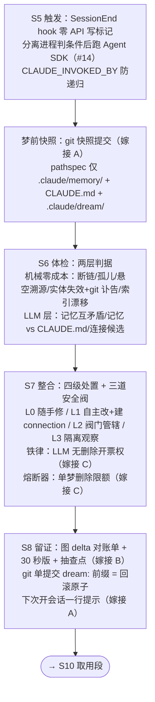

# Sketches · Target-1 整合段定稿方案

**拍板记录**：Decider 2026-08-02 评审四份竞争草图（[../Ideate/SketchPool.md](../Ideate/SketchPool.md)）后选定——**Sketch-D wiki 派为主体，嫁接 A/B/C 三派优秀设计**。选 D 的核心理由：四份中唯一兑现长期目标"复利"（connection 即记忆，在官方契约内让知识网生长），且其体检判据、隔离安全阀与其他三派高度兼容，嫁接面干净。

**效力**：本文件是 Ideate 的收官定稿，本原型段（Prototype-01-FirstDream）的方案依据。与原始草图冲突时以本文件为准；弹药 #号指 [../Ideate/IdeaPool.md](../Ideate/IdeaPool.md)。

## 方案总览

记忆文件系统在官方 auto-memory 契约（一记一文件 + MEMORY.md 纯指针索引）之上叠加 wiki 器官：frontmatter 溯源链（`sources:`）+ 正文 Related 双链节 + `type: connection` 记忆。梦 = 体检 → 整合 → 留证，全程无人值守，git 为回滚层。



## S6 体检：判据清单

机械层（纯文件 I/O，零 LLM 成本，先跑）：

| 编号 | 判据 | 可执行描述 |
|---|---|---|
| M1 断链 | `[[目标]]`/Related 指向的文件不存在 | 解析双链逐一 stat |
| M2 孤儿 | 无出链且无入链 | 全库链接图反查（冷启动期整体禁用，见风险 R3） |
| M3 悬空溯源 | `sources:` 指向的日志/文件已消失 | 逐条 stat |
| M4 实体失效 | 正文引用的路径/函数/命令在当前项目 0 命中 | 正则抽 token → `test -e` / `git grep -c`；**再跑 git 讣告升级证据**（嫁接 C 的 J2）：`git log --diff-filter=D -- <path>` 查到删除提交 → 证据"确凿"；查不到 → 仅"候选"（防改名误判，C 自报风险 2 的缓解） |
| M5 索引漂移 | MEMORY.md 行集合 ≠ 实际文件集合 | 双向对账，auto_fixable |

LLM 层（只吃机械层筛出的候选，每项判断必须引用双方原文/现状出处——嫁接 B 的"无证不理"纪律）：

| 编号 | 判据 | 说明 |
|---|---|---|
| S1 记忆互矛盾 | 两条记忆打架 | 按 git 时间序 + 现实核验裁决，不许投票 |
| S2 记忆 vs CLAUDE.md | 断言与人写层冲突 | 引现状出处，处置走 L2 阀门 |
| S3 连接候选 | 2+ 记忆共享实体却无边（机械共现先筛）| LLM 只判"非显然"与否 |

## S7 整合：权限模型（四级处置 + 三道安全阀）

**处置分级**（D 的 L0–L3 为骨架，融合 C 铁律与 B 证明力轴）：

| 级 | 动作 | 授权条件 |
|---|---|---|
| L0 随手修 | 修断链、补反链、修索引、相对日期转绝对 | 结构性问题，auto_fixable，直接做 |
| L1 自主改 | 删实体失效记忆、合并重复、**建 connection** | **删除票只能由机械确凿证据开出（M4+讣告级）**；LLM 判据只能否决、标注或降级，不能单独定删（嫁接 C 铁律）。合并不灭失信息。connection 须过 S3 且**单梦限建 2 条**（D 自报风险 1 的缓解：废边防线） |
| L2 阀门管辖 | 改 CLAUDE.md | `claude_md_edits` 阀门（Decider 定向：默认开）；关闭降级为"报告列建议 + 记忆侧 contradicts 标注" |
| L3 隔离观察 | 判据不足、或 **feedback 类（用户亲口纠正过的，嫁接 A）** | frontmatter 标 `status: quarantined` + 原因，原地保留；连续两梦无翻案证据才升级 L1 候删；feedback 类永不自动删，只进报告"待你裁决"节 |

**三道安全阀**：

1. **熔断器**（嫁接 C）：单梦删除数 > max(3, 库存 10%) → 中止整梦、reset 回梦前快照、报告写明熔断——#47959 式连删在结构上不可能；
2. **配置层缴械**（#6）：梦 agent 工具白名单锁死为 Read/Grep/Glob + Write（仅 `.claude/memory/`、`.claude/dream/`、CLAUDE.md）+ Bash（仅 git），势力范围由权限层保证；
3. **隔离优先**：删错≫留错（#4），拿不准一律 quarantine 不删。

## S8 留证：凭证形态

报告 `.claude/dream/<日期-主题>.md`，结构（D 图 delta 为骨架，嫁接 B 的对账单三段/30 秒版/抽查点）：

1. **标题行**：图 delta 数字（N 记忆 → N'，新边 +k，隔离 m）＝期初/期末对账；
2. **30 秒版**（嫁接 B）：动了什么敏感的（CLAUDE.md 笔目置顶）、删了几条、整梦撤销命令一行；
3. **明细**：每笔四要素（嫁接 C）——动作 | 判据编号 | 证据（可复现命令或原文引用）| 单条回滚命令；connection 附全文链接；
4. **隔离观察区**：本梦挂起 + 上梦复审结果；
5. **抽查点**（嫁接 B）：自动挑证明力最弱的 3 笔生成一键核查项；
6. **尾行**：当前阀门状态（用户永远看得见开关）。

**git**：梦前快照提交（嫁接 A 的 Phase 0）+ 梦后 `dream:` 前缀单提交 = 回滚原子；`git revert` 一步整梦撤销。
**送达**（嫁接 A）：下次 SessionStart 注入一行——"昨夜做了一场梦：删 2 合 1 新连接 1，报告 → 路径"；这是对"没人真的去看报告"的第一道解药，30 秒版是第二道。

## 阀门配置汇总（`.claude/claude-dream.local.md`）

```yaml
---
enabled: true
claude_md_edits: true        # 关 → CLAUDE.md 一字不动，报告列建议 + 记忆侧标注
delete_policy: quarantine-first   # 或 report-only：连删都降级为汇报
max_deletes: 3               # 熔断线（或库存 10%，取大）
max_new_connections: 2       # 单梦新边限额（废边防线）
llm_checks: on               # 关 → 纯机械梦，零 API 成本
---
```

## 嫁接清单（来源追溯）

| 嫁接元素 | 来自 | 一句话理由 |
|---|---|---|
| 梦前快照提交（pathspec 限定） | A | 保证 dream 提交不混入用户改动，回滚原子干净 |
| feedback 类记忆永不自动删 | A | 直接防"错删用户强调过三次的规则"（#47959 核心痛点） |
| 开新会话一行提示 | A | 报告的送达机制，冲刺问题 3 的第一道解药 |
| 30 秒版 + 抽查点 + 对账单期初期末 | B | 把"信任但要验证"压到 30 秒动作 |
| 证据引用纪律（LLM 判断必须引原文） | B | 无证不理，报告可辩护 |
| LLM 无删除开票权铁律 | C | 语义误删的结构性防线 |
| 熔断器 | C | 连删事故在结构上不可能 |
| git 讣告（删除提交查证） | C | 实体失效证据从"0 命中"升级到"确凿"，兼防改名误判 |
| 报告每笔四要素含单条回滚命令 | C | 撤销粒度从整梦细化到单笔 |

**未嫁接而记录在案**：A 的"官方 gate 放行后双写冲突"风险（进风险表 R4）；B 的"无证不删工程护栏"（报告生成器校验引用——Prototype 阶段再决定是否实现，暂以提示词+抽查点近似）。

## 风险与缓解

| # | 风险（来源） | 缓解 |
|---|---|---|
| R1 | LLM 量产废连接毁信任（D 自报） | 机械共现前筛 + 单梦限建 2 条 + 报告附全文供抽查；Test 阶段以"用户看到 connection 的反应"为观察点 |
| R2 | 官方 auto-memory 未来重写记忆文件剥掉 wiki 器官（D 自报） | 无根治；MEMORY.md 纯指针契约不动是底线，wiki 层可由体检重建（M1–M3 发现蒸发即报告） |
| R3 | 小库冷启动孤儿判据全是噪音（D 自报） | 记忆 <15 条时禁用 M2 与孤儿观察 |
| R4 | 官方 gate 放行后双写同一记忆目录（A 自报） | 记录在案，Prototype 阶段设计锁文件互斥；短期风险低（gate 两年未放行） |
| R5 | 偏好/教训类记忆无可核验实体，机械判据失明（C 自报） | 此类多为 feedback/user 型，本就走 L3 保护；S1/S2 语义层兜底 |
| R6 | 30 秒版也没人读（B 自报） | 冲刺问题 3 本身，留给 Test 阶段宣判——这正是周五要测的核心假设 |

## 与 Target 通过标准对照

TargetMap 通过标准：真实腐烂记忆库上跑通一次整合，产出改动后的记忆+CLAUDE.md、梦报告、可回滚 git 提交，删除决策可辩护。本方案逐项有着落：判据编号+证据=可辩护；报告=梦报告；快照+dream 提交=可回滚；L2 阀门=CLAUDE.md 修改。**"哪些必须问、哪些随手处理"的分界已声明**（L0–L3 表），兑现 TargetMap 预留事项。

## 附注：wiki 层的可剥离性

四份草图在骨架上同构（机械判据打底 + LLM 语义 + 分级处置 + git 留证），wiki 是叠加其上的组织形态——其独有贡献是两点：connection 让 S7 从只做减法变成也做加法（复利兑现），链接结构自带免费体检信号（M1–M3）。**正因同构，wiki 层可剥离**：若 Test 宣判 R1 成立（connection 是废边制造机），关掉 wiki 层即退回纯维护梦，主干无伤。
