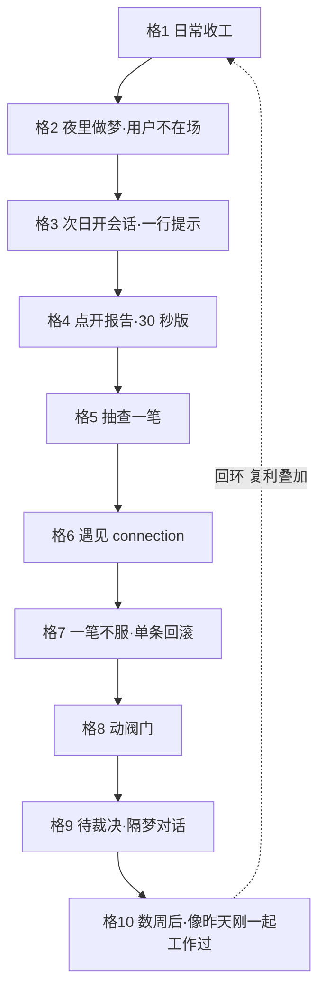

# Storyboard · Target-1 双侧故事板

**这是什么**：把 [Sketches.md](Sketches.md) 定稿方案铺成时间序列。本产品有**两个经历者**，故事板因此分两部：**Part 1 用户侧十格**——人会经历什么，Friday Test 的剧本；**Part 2 梦侧九镜**——梦 agent 每一步看见什么输入、做什么、产出什么，Thursday 施工的剧本。用户侧十格里的"格 2 黑幕"展开即是整个 Part 2——那里藏着 Target 本体，不许省略。

**原型定位**：TargetMap 通过标准要求"整合在真实腐烂的记忆库上跑通"——故本原型**不是**纯 Wizard of Oz：记忆库是造的假数据，但**梦必须真跑**，报告、connection、git 提交都必须是真产物；用户侧测试拿真产物做道具。

**场景设定（两部共用）**：项目 acme-api，记忆库 40+ 条、其中 5 条已腐烂（三周前 Express→Fastify 迁移遗留：实体失效 ×2、重复 ×2、矛盾 ×1），CLAUDE.md 含 1 处过期命令。

## Part 1 · 用户侧十格（Test 剧本）

| 格 | 用户看见/做什么 | 背后组件 | 备注 |
|---|---|---|---|
| 1 **日常收工** | 在 acme-api 干完活，关掉会话。屏幕上无任何打扰 | SessionEnd hook 零 API 写标记（<10s，静默） | 开场格：插件存在感应为零 |
| 2 **夜里做梦** | （用户不在场——黑幕格）唯一痕迹：git log 里多了两个提交 `dream: snapshot` 与 `dream: 2026-08-02` | **本格展开 = Part 2 全部九镜** | "人不参与梦"的画面化；梦侧剧本见 Part 2 |
| 3 **次日开会话** | 开场看到一行："昨夜做了一场梦：删 2 · 合 1 · 新连接 1 · 隔离 2，报告 → .claude/dream/2026-08-02.md"。可以无视继续干活 | SessionStart 注入（嫁接 A 送达机制） | 分支：无视也不出错——报告不阻塞任何事 |
| 4 **点开报告** | 先见 30 秒版：动了 CLAUDE.md 一处（置顶）、删 2 条、整梦撤销命令一行 | S8 报告结构 §2（嫁接 B） | **Test 关键观察①**：用户真的只花 30 秒吗，读完是安心还是紧张 |
| 5 **抽查一笔** | 点抽查点 1：`git diff` 看 CLAUDE.md 改动——"构建命令确实早改成 pnpm 了"，证据成立 | 抽查点自动生成（嫁接 B）+ 每笔四要素（嫁接 C） | **Test 关键观察②**：抽查邀请有没有人接 |
| 6 **遇见 connection** | 报告"新连接"条目点开全文："限流若排在 JWT 之后，未认证流量能耗尽 Redis 配额——你自己没连起过这条线" | S7 L1 建 connection（D 主体，复利兑现处） | **Test 关键观察③**：用户反应是"有点东西"还是"废话"——R1 的宣判格 |
| 7 **一笔不服** | 明细里一条删除他不认可（或隔离区一条想保留）——复制该笔的单条回滚命令，一贴即恢复；顺口在会话里说"这条别删" | 单条回滚（嫁接 C）；纠正被会话 agent 记为 feedback 记忆 | 错误可低成本撤销 = HMW"删的代价低到敢让 agent 删"的画面化 |
| 8 **动阀门** | 打开 `.claude/claude-dream.local.md`，把 `claude_md_edits` 关掉（试探期不想让它碰 CLAUDE.md） | 阀门配置（Decider 定向 #5） | 下一梦报告里该类笔目变为"建议（未动）"——降级行为可见 |
| 9 **待裁决·隔梦对话** | 报告"待你裁决"：vitest vs jest 两条记忆矛盾、机械侧无法定谳。用户在会话里说"用 vitest"——下一梦执行处置 | L3 + feedback 通道：人不进梦，但人与梦隔梦对话 | 人的裁决权画面化：梦提问、人回答、下一梦执行 |
| 10 **数周后** | 开新会话，agent 开场就带着准确的项目现状干活，还引用了一条 connection 提醒他坑——"像昨天刚一起工作过" | 整个回环 S10–S11→S1 复利叠加 | 长期目标的画面化；END 即下一轮开场 |

## Part 2 · 梦侧九镜（施工剧本——格 2 黑幕的展开）

每镜 = 梦 agent 看见什么输入 → 做什么 → 产出什么。工程镜（脚本执行，零 LLM）与 agent 镜（LLM 在场）分开标注。

| 镜 | 类型 | 输入 → 动作 → 产出 |
|---|---|---|
| D1 **触发判定** | 工程 | SessionEnd 标记文件 + 条件（冷却期已过 且 memory/ hash 变化）→ 分离进程启动，`CLAUDE_INVOKED_BY` 防递归 → 梦进程起，工具白名单缴械（安全阀 2） |
| D2 **梦前快照** | 工程 | 当前 `.claude/memory/` + CLAUDE.md + `.claude/dream/` → `git commit`（pathspec 限定）→ 快照提交，回滚锚点 |
| D3 **定向** | agent | 记忆目录清单 + MEMORY.md + CLAUDE.md + 上梦报告的隔离区清单 → 建立库存台账、领取上梦遗留复审任务 → 工作清单 |
| D4 **机械体检** | 工程 | 全库记忆文件 → 跑 M1–M5 脚本（断链/孤儿/悬空溯源/实体失效+git 讣告/索引漂移）→ 候选清单（每条带证据：命令+输出） |
| D5 **语义体检** | agent | 候选清单 + 项目现状（代码/README/git log）→ 判 S1 互矛盾 / S2 vs CLAUDE.md，每判必引双方原文 → 语义候选（带引文） |
| D6 **处置执行** | agent | 全部候选 + L0–L3 权限模型 → 逐笔处置：删除仅限机械确凿证据（铁律）、拿不准 quarantine、feedback 类只挂待裁决；**每写一笔登记四要素、熔断计数器 +1，超限即中止回滚** → 改动后的记忆库 + CLAUDE.md（阀门开时） |
| D7 **连接创造** | agent | 共现筛出的连接候选（2+ 记忆共享实体且无边）→ 判"非显然"，通过者建 connection 文件 + 两端补双向链，**单梦 ≤2 条** → 新 connection 记忆 |
| D8 **写报告** | agent | 四要素台账 + 图 delta + 隔离区 + 抽查点选取（证明力最弱 3 笔）→ 按 S8 六节结构写 → `.claude/dream/<日期-主题>.md` |
| D9 **收尾提交** | 工程 | 全部改动 → `dream:` 前缀单提交、更新触发标记、校验 MEMORY.md 契约完整 → 回滚原子 + 下梦的输入状态 |

*镜与镜的边界即 Prototype 的模块边界：D1/D2/D4/D9 是脚本，D3/D5–D8 是梦提示词的章节——但处置铁律与熔断必须落在工程层（反面清单 5），不能只写进提示词。*

## Prototype 道具与施工清单（双侧反推，Thursday 分工）

**造的（假数据）**：
1. 腐烂记忆库：acme-api 虚构项目——40+ 条记忆（5 条腐烂如场景设定）+ CLAUDE.md（1 处过期）+ 假 git 历史（含实体删除提交，喂 M4 讣告）；

**真跑的（梦引擎最小实现，按 Part 2 九镜施工）**：
2. D1/D2/D9 触发与 git 脚本；D4 机械体检脚本（M1–M5）；
3. D3/D5–D8 梦提示词（含 L0–L3 权限模型、铁律、报告六节模板）；熔断与写路径白名单落工程层；

**真产物当道具（用户侧测试用）**：
4. 梦报告、connection 记忆、git log/diff——全部来自真跑；
5. SessionStart 一行提示文案（格 3）；阀门文件 + 关阀对照报告（格 8，跑两次梦对照）。

*注：Friday Test 的判据缺口（五条验收信号不可操作）在原型定稿前必须补——Test 关键观察①②③是起点，不是全部。*
