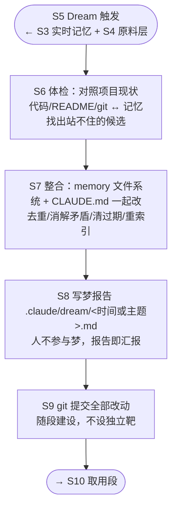

# Target-1 · 整合段（S6–S8）

## Goal

> **造出"梦"的良心：体检 → 整合 → 留证三步装配成一次可信的整合——面对一个已经腐烂的记忆库，找出站不住的条目、动手改掉（memory 文件系统与 CLAUDE.md 一起）、并留下一份人能看懂的变更凭证；"信任"二字在此兑现：用户敢让 agent 自己删，且事后看得清、退得回。**

**为什么圈这里。** 8 条 HMW 中 6 条落在此段，且**过期族 3 条、透明族 2 条、所有权族 2 条三族全覆盖**（靶外 2 条同属取用段）；对齐当前权重第一的冲刺问题 1（过期）与问题 4（所有权）；官方 Auto Dream 正是在 S7 翻的车——[anthropics/claude-code#47959](https://github.com/anthropics/claude-code/issues/47959) 24 小时内静默删除 23 个记忆文件，含用户强调过三次的规则。这是全图**机会最大、失败风险也最大**的位置：整张地图上只有这一段真正写文件、造成不可逆损失，前面都是读与判断。

**Challenge 势力范围的兑现处。** Challenge 写的是"整合记忆文件**与 CLAUDE.md**"——而官方提示词明写 `do NOT edit CLAUDE.md during a dream`，即使记忆明确纠正了它也只标注、只报告。**我们打算做官方明确不做的事，敢做的依据是 git 回滚层**（差异化定位①，见 [../ChallengeBackground.md](../ChallengeBackground.md) §5）。这个赌注成不成立，在本段见分晓。

**前置与后置基础设施（随段建设，不设独立靶）。**

- **S4 原料层**（前置）——梦的输入。官方 `logs/` 层本机全项目不存在，须自建；其"机械压缩 vs LLM 提炼"的定位含糊**未决，留待 Ideate**（见段末备注）。8 条 HMW 一条未挂 S4，故不设靶。
- **S9 git 提交**（后置）——S8 梦报告的落盘动作，与 S8 不可分割。HMW 1 与 4 均同时挂步 9，故随段建设，不单独圈。

**通过标准（达成即放行下一段）。** 一次整合能在真实腐烂的记忆库上跑通并产出三样东西：改动后的记忆文件系统与 CLAUDE.md、一份梦报告、一个可回滚的 git 提交。**删除决策须可辩护**——每条被删的记忆都说得出判据来自哪里（项目现状对照？用户当场纠正？）。具体阈值与"哪些必须问、哪些随手处理"的分界在 Ideate/Prototype 阶段声明，不在此预设。

## Questions

| 冲刺问题 | 在本段的位置 |
|---|---|
| **1 过期**（权重第一） | **主答——答案在本段被制造**。S6 产出判据，S7 执行处置；"错删和错留哪个代价更高"在此段有了实际后果 |
| **4 所有权** | 段内兑现——S7 是唯一动 CLAUDE.md 的地方，"哪些能自己改、哪些只能提议"的边界在此划定 |
| **3 信任** | 在此制造证据——S8 梦报告 + S9 提交产出"可回看、可回滚"的实物；**够不够替代事前批准，须待用户面对真实报告才能宣判**，不在本段结案 |
| 2 取用 | **整条在靶外**（S10–S11 取用段）。本段做对是它的前提：整合错了，取用侧校验再准也只是准确地取到一条错记忆 |

## Target Map and HMW

| HMW | 对应 | 族 |
|---|---|---|
| 我们如何能让"这条记忆已经错了"被尽早发现，而不是等用户在对话里撞上？ | S6（跨至 S11） | 过期 |
| 我们如何能让删掉一条记忆的代价，低到用户敢让 agent 自己删？ | S7（含 S9 回滚层） | 过期 |
| 我们如何能让用户放心直接改动 agent 维护的记忆，而不担心破坏某种看不见的契约？ | S7 | 所有权 |
| 我们如何能区分"删之前必须问我"和"随手处理就好"的记忆？ | S7 | 所有权 |
| 我们如何能让每一次整合的改动，事后随时看得清、退得回？ | S8（含 S9 提交） | 透明 |
| 我们如何能让用户一眼看到，agent 现在到底相信关于他和这个项目的哪些事？ | S8（跨至 S10） | 透明 |

*本段 Ideate 尚未启动。发散范围是上表六条 HMW——核心是三件事：**判据从哪来**（S6 凭什么说一条记忆站不住）、**谁有权删**（S7 的所有权边界与安全阀）、**凭证长什么样**（S8 报告写成什么形态才有人真的看）。*

---

### 备注：靶外与未决事项

***靶外的 2 条 HMW**（"用记忆前先确认它还成立"、"记忆身份不因改名搬迁失效"）均属取用段 S10–S11，对应冲刺问题 2。**未被丢弃**——取用段是本段通过后最可能的 Target-2，见 [../DesignMap.md](../DesignMap.md) Target 节。*

***S4 定位未决**——现标签"有损压缩层"含糊：机械压缩（`>` 用户 `<` 助手 `.` 工具的活动流，不做语义判断，SessionEnd 无需 LLM）与 LLM 提炼（SessionEnd 就判断"这条值不值得记"，正面撞上"插件形态无免费离线时刻"）是两条路，工程代价天壤之别。**Decider 2026-08-01 决定先不定，留待 Ideate。** 影响本段的部分：梦拿到的输入是原始活动流还是已提炼条目，决定 S6 体检的起点。*

***wiki（建立跨记忆关联）落在 S7**——即 compiler `compile.py` 那种按概念组织、带 `[[双链]]` 的知识网。它是"整合成什么形态"的一种填法（对应 S7 的产出形态），属本段 Ideate 的发散内容，本轮不预先收敛。*

***已知缺口：长期目标的"复利"当前无兑现处。** 长期目标许诺"agent 能连起你自己都没连起的线索"，但 S7 现有四个动作（去重/消解矛盾/清过期/重索引）**全是维护性的，没有一个在创造新连接**。整张 Map 亦无其他步骤承担此事。此缺口在 Pick a Target 讨论中发现，本轮不解决——若 Ideate 采纳 wiki 类方案，它同时也是这个缺口的候选解药。*
