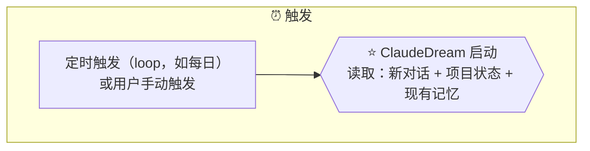

# Target A: Loop 触发 — TargetMapping

## 一、Target Goal

验证 ClaudeDream 的定时触发机制能否可靠运行。

### 关键问题

- ClaudeDream 如何被定时唤醒？
- Claude Code 自身 loop 能力是否足够？
- 手动触发与自动 loop 如何共存？

## 二、关联 Map & HMW

### Map 关联

Focus: ⏰ 触发 → ⭐ 启动

### HMW 关联

| # | HMW | 关联 Map |
|---|---|---|
| H1 | HMW 让 ClaudeDream 通过可靠的定时机制（loop）自动运行，用户不需要记得手动触发？ | ⏰ 触发 |
