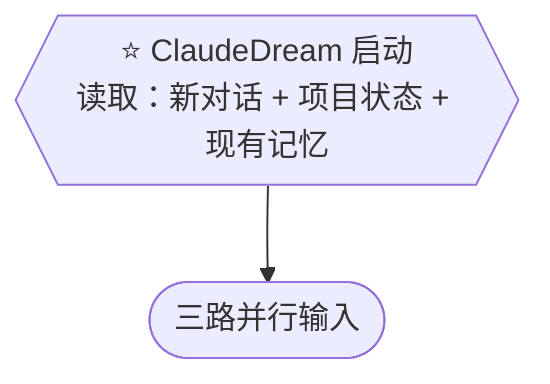

# Target B: 输入读取与解析 — TargetMapping

## 一、Target Goal

验证三路输入（对话历史、git 历史、现有记忆）能否成功读取并汇入综合判定。

### 关键问题

- 对话历史文件什么格式、怎么解析？
- git 历史取多深、什么算有意义的变更？
- 三路输入能否成功汇入综合判定？

## 二、关联 Map & HMW

### Map 关联

Focus: ⭐ 启动 → 三路并行输入

### HMW 关联

| # | HMW | 关联 Map |
|---|---|---|
| H2 | HMW 让 ClaudeDream 读取并解析 Claude Code 对话历史文件（JSON 等格式），从中提取候选记忆素材？ | ⭐ 启动 → 输入读取 |
| H3 | HMW 让 ClaudeDream 利用 git 历史感知项目变化——不只是文件当前状态，还有变更轨迹与趋势？ | ⭐ 启动 → 输入读取 |
