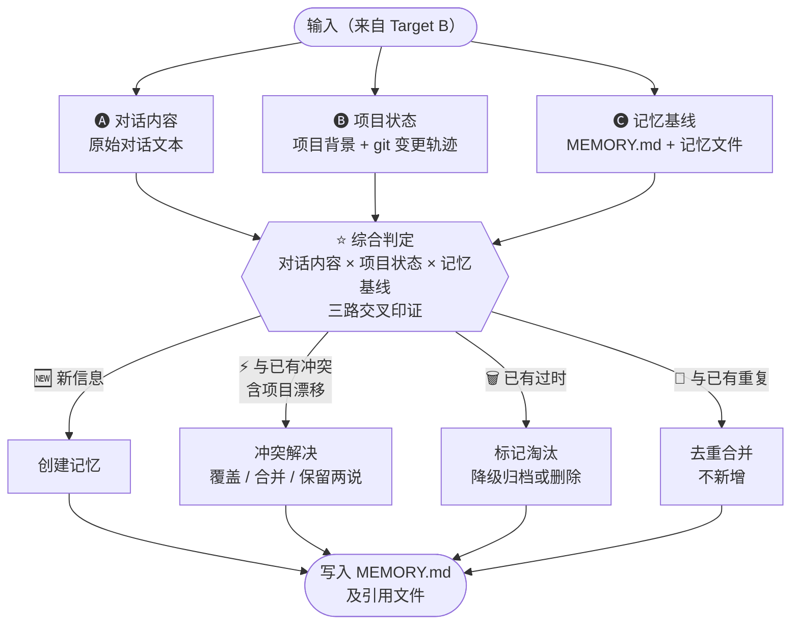

# Target C: 综合判定 — TargetMapping

## 一、Target Goal

验证综合判定能否正确区分新信息、冲突、过时、重复，并生成用户可接受的结果。这是整个 ClaudeDream 的命门。

### Sprint Questions

1. 记忆系统真的能从一段对话中区分「值得记住的信息」和「噪音」？
2. 记忆系统真的能自我更新——对冲突覆盖、对过时淘汰、对冗余降级，而不只是追加？
3. 记忆系统真的能感知到旧记忆已被后续对话修正或推翻——而不是在新对话面前无动于衷？
4. 记忆系统真的能感知项目的变化并与项目保持同步，而不是渐渐变成一个与项目脱节的独立信息库？

### 关键问题

- 给定真实输入，系统能否正确区分新信息、冲突、过时、重复？
- 判定结果能否让用户接受？
- 四条 Sprint Question 能否答"是"？

## 二、关联 Map & HMW

### Map 关联

Focus: 🅐🅑🅒 → ⭐ 综合判定 → 四条分支 → 写入

### HMW 关联

| # | HMW | 关联 Map |
|---|---|---|
| H4 | HMW 让系统从对话素材中区分「值得记住的信息」和「噪音」？ | 🅐 对话内容 |
| H5 | HMW 让系统从 git 变化中识别哪些是对记忆有影响的「项目漂移」？ | 🅑 项目状态 |
| H6 | HMW 让系统识别「用户改主意了」——新对话推翻了旧认知，而不只是「用户又说了不同的话」？ | 🅒 现有记忆路径 → ⚡ 冲突解决 |
| H7 | HMW 给记忆引入生命周期——不重要的淡出、冲突的合并/覆盖、过时的归档、重复的去重？ | ⭐ 综合判定 → 四条分支 |
| H8 | HMW 让 ClaudeDream 执行后向用户报告变更摘要——更新了什么、为什么，让用户审阅结果？ | 写入 MEMORY.md |
| H9 | HMW 让写入的记忆格式既能被 Claude Code 原生高效读取，又能作为下一轮批处理的可靠比对基线？ | 写入 MEMORY.md → 🅒 现有记忆路径 |
