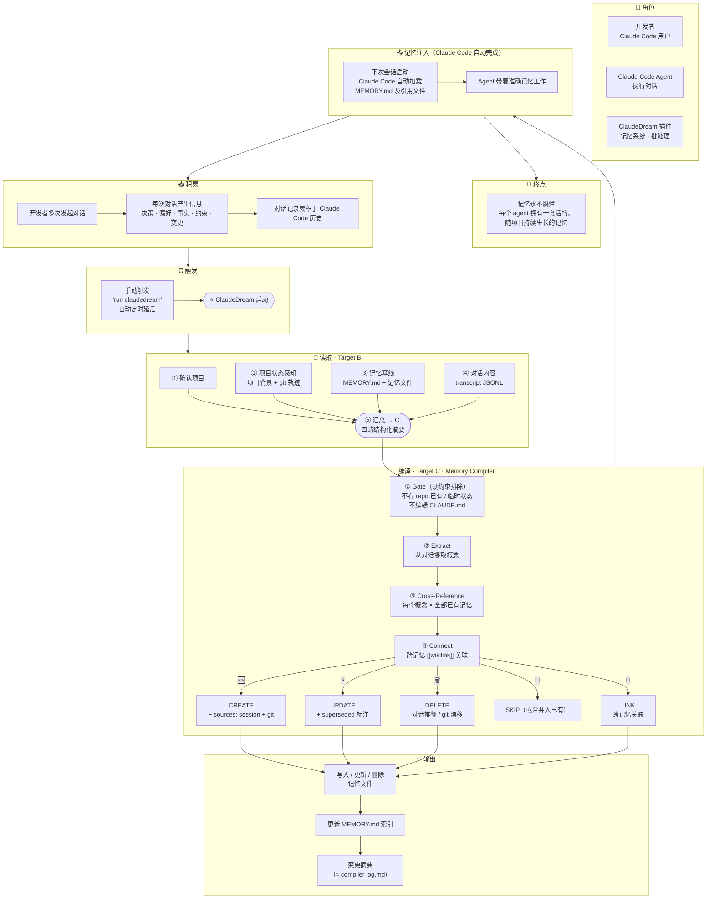

# ClaudeDream — Architecture

> 本文件摘抄自 `.IDEO/DesignSprint/DesignMapping.md` 的架构地图，作为 [Product Backlog](ProductBacklog.md) 各条「架构定位」列的对照底图。地图的权威版本在 DesignMapping；此处随实现推进保持同步。

## Map

```mermaid
flowchart TB
    subgraph LEFT["👤 角色"]
        DEV["开发者\nClaude Code 用户"]
        AGENT["Claude Code Agent\n执行对话"]
        CD["ClaudeDream 插件\n记忆系统 · 批处理"]
    end

    subgraph RIGHT["🎯 终点"]
        GOAL["记忆永不腐烂\n每个 agent 拥有一套活的、\n随项目持续生长的记忆"]
    end

    subgraph ACCUM["📥 积累"]
        A1["开发者多次发起对话"] --> A2["每次对话产生信息\n决策 · 偏好 · 事实 · 约束 · 变更"]
        A2 --> A3["对话记录累积于 Claude Code 历史"]
    end

    subgraph TRIGGER["⏰ 触发"]
        T1["手动触发\n'run claudedream'\n自动定时延后"]
        T2{{"⭐ ClaudeDream 启动"}}
        T1 --> T2
    end

    subgraph READ["📖 读取 · Target B"]
        R1["① 确认项目"]
        R2["② 项目状态感知\n项目背景 + git 轨迹"]
        R3["③ 记忆基线\nMEMORY.md + 记忆文件"]
        R4["④ 对话内容\ntranscript JSONL"]
        R1 & R2 & R3 & R4 --> R0(["⑤ 汇总 → C:\n四路结构化摘要"])
    end

    subgraph COMPILE["🔄 编译 · Target C · Memory Compiler"]
        direction TB
        GATE["① Gate（硬约束排除）\n不存 repo 已有 / 临时状态\n不编辑 CLAUDE.md"]
        EXTRACT["② Extract\n从对话提取概念"]
        XREF["③ Cross-Reference\n每个概念 × 全部已有记忆"]
        CONN["④ Connect\n跨记忆 [[wikilink]] 关联"]
        R0 --> GATE --> EXTRACT --> XREF --> CONN
        CONN -->|"🆕"| C1["CREATE\n+ sources: session + git"]
        CONN -->|"⚡"| C2["UPDATE\n+ superseded 标注"]
        CONN -->|"🗑️"| C3["DELETE\n对话推翻 / git 漂移"]
        CONN -->|"🔁"| C4["SKIP（或合并入已有）"]
        CONN -->|"🔗"| C5["LINK\n跨记忆关联"]
    end

    subgraph OUTPUT["📝 输出"]
        O1["写入 / 更新 / 删除\n记忆文件"]
        O2["更新 MEMORY.md 索引"]
        O3["变更摘要\n（≈ compiler log.md）"]
        C1 --> O1 --> O2 --> O3
        C2 --> O1
        C3 --> O1
        C5 --> O1
    end

    subgraph INJECT["📤 记忆注入（Claude Code 自动完成）"]
        I1["下次会话启动\nClaude Code 自动加载\nMEMORY.md 及引用文件"] --> I2["Agent 带着准确记忆工作"]
    end

    ACCUM --> TRIGGER
    TRIGGER --> READ
    COMPILE --> INJECT
    INJECT --> ACCUM
    INJECT --> RIGHT
```
