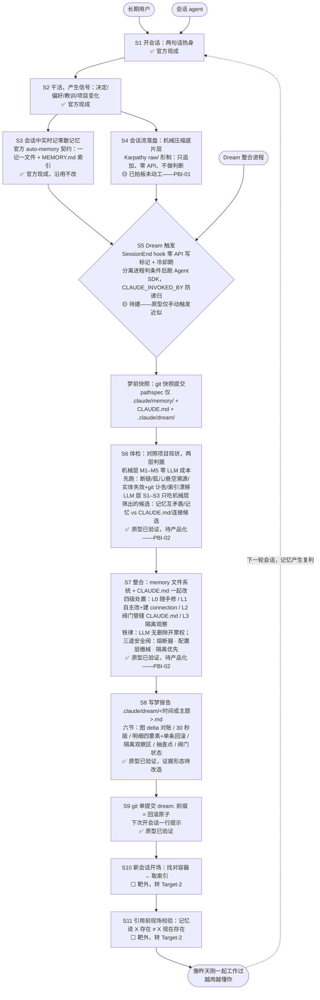

# Architecture

## 角色

| 角色 | 解释 |
|---|---|
| 长期用户 | 产品的顾客：要 agent 像昨天刚一起工作过，且随时能推翻产品的改动 |
| 会话 agent | 记忆的生产者与消费者：会话中产生信号，开新会话时取用记忆 |

## 架构图

| 批注 |
|---|
| Dream 整合进程即产品自身——无人值守跑 S5–S9，人不参与梦，报告即汇报 |
| 官方 auto-memory 契约是硬约束：一记一文件 + MEMORY.md 纯指针索引，不得破坏 |
| 取用在架构上不被保证——记忆是 context，不是 enforced configuration，S11 只是最后一道拦截 |
| 记忆容器按工作目录路径字符串键控，项目改名/搬盘会静默孤立记忆（本项目 2026-07-29 实际发生过） |

*出处：数据流与角色取自 [.IDEO/design-sprint/DesignMap.md](.IDEO/design-sprint/DesignMap.md)；S5–S8 内部结构（触发、快照、判据、处置、阀门、报告六节）取自 [Sketches.md](.IDEO/design-sprint/Target-1-Consolidation/Prototype-01-FirstDream/Sketches.md) 定稿方案，完整论证与阀门配置回该文件查；实现状态标注综合 [TargetMap.md](.IDEO/design-sprint/Target-1-Consolidation/TargetMap.md)、[DesignReview.md](.IDEO/design-sprint/DesignReview.md) §5、§7 与 [verdict.md](.IDEO/design-sprint/Target-1-Consolidation/Prototype-01-FirstDream/verdict.md)。*
