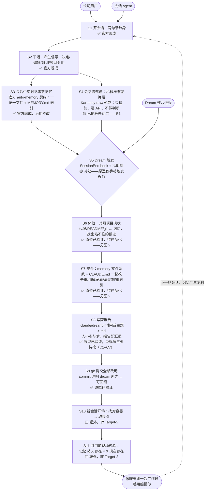
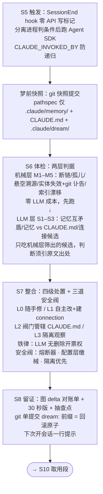

# Architecture

以图为主，说明从简。两张图：全流程 11 步 + S6–S8 整合段下钻。地图内容取自设计冲刺定稿，出处见每节末尾；具体判据/权限/阀门的完整论证不在本文重复，去源文件读。

## 图 1 · 全流程 11 步（会话 → 整合 → 下一轮会话，共 11 步 + 回环）

**角色与结果表**：

| 角色 | 在图上的位置 | 关切什么 |
|---|---|---|
| 长期用户（唯一真实的人，当前即 Decider 本人） | 起点 S1、终点 END；**梦期间不在场** | 开会话不用重新解释；不被错误记忆坑；随时能推翻 agent 的判断 |
| 会话 agent | S1–S4 干活并产生信号、S10–S11 取用记忆 | 拿到的记忆现在还成不成立；容器找对没有 |
| Dream 整合进程 | S5–S9，无人值守 | 该删的删干净、不该删的一条不碰；改动留得下凭证 |
| 官方 auto-memory 契约 | 约束 S3 与 S7 的存储形态 | 一记一文件 + MEMORY.md 纯指针索引，不可协商、不得破坏 |

**两条横向批注**（贯穿全流程的地基限制，不属于某一步）：

- 取用在架构上不被保证——官方文档明写记忆是 context，不是 enforced configuration；S11 是运行时最后一道拦截，不是根治。
- 记忆容器按工作目录路径字符串键控——项目改名/搬盘会静默孤立记忆（本项目 2026-07-29 重启搬盘时已实际发生）。

**出处**：[.IDEO/design-sprint/DesignMap.md](.IDEO/design-sprint/DesignMap.md) 数据流图与角色表；实现状态标注综合自 [.IDEO/design-sprint/Target-1-Consolidation/TargetMap.md](.IDEO/design-sprint/Target-1-Consolidation/TargetMap.md)、[.IDEO/design-sprint/DesignReview.md](.IDEO/design-sprint/DesignReview.md) §5、§7。

## 图 2 · S6–S8 整合段下钻

**S6 体检判据**：机械层 M1–M5（断链、孤儿、悬空溯源、实体失效+git 讣告升级证据、索引漂移）零 LLM 成本先跑；LLM 层 S1–S3（记忆互矛盾、记忆 vs CLAUDE.md、连接候选）只吃机械层筛出的候选，判断必须引双方原文/现状出处。

**S7 处置分级**：L0 随手修（结构性问题，直接做）／L1 自主改（删实体失效记忆、合并重复、建 connection——删除票只能由机械确凿证据开出，LLM 判据只能否决或降级）／L2 阀门管辖（改 CLAUDE.md，默认开、可关）／L3 隔离观察（判据不足或 feedback 类记忆，永不自动删）。

**三道安全阀**：熔断器（单梦删除数超限即中止整梦并回滚）、配置层缴械（梦 agent 工具白名单锁死）、隔离优先（拿不准一律 quarantine 不删）。

**S8 报告六节**：标题行图 delta 对账、30 秒版、明细（每笔四要素+单条回滚命令）、隔离观察区、抽查点、阀门状态尾行。

**出处**：[.IDEO/design-sprint/Target-1-Consolidation/Prototype-01-FirstDream/Sketches.md](.IDEO/design-sprint/Target-1-Consolidation/Prototype-01-FirstDream/Sketches.md)（定稿方案全文，含判据表、权限模型表、阀门配置 YAML、嫁接清单）；施工验收结论见 [verdict.md](.IDEO/design-sprint/Target-1-Consolidation/Prototype-01-FirstDream/verdict.md)。
