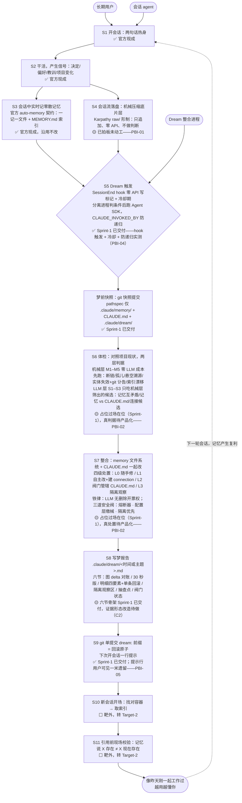

# ProductBacklog

按 SGEP 的四件套承诺关系组织：Product → Definition of Outcome Done，Increment → Definition of Output Done，Product Backlog → Product Goal。第四件（Sprint Backlog → Sprint Goal）属 Sprint 级，开 Sprint 时另建文件。

## 第一部分 · 产品、目标与完成定义

### 1. Product

> **claude-dream——一个 Claude Code 插件，为长期使用 Claude Code 的人提供可信的记忆离线整合（体检 → 整合 → 留证），使 agent 记忆免于腐烂，与用户和项目保持同步。**

*类型：按 SGEP 的 experience / platform 二分是 experience——直接面向用户解决一个具体问题，不是给别人搭产品的底座。满足缺口：长期使用下 agent 记忆会腐烂——自信引用过期事实，用户从此条条核实；官方离线整合零留证、禁碰 CLAUDE.md，且出过静默删除 23 个记忆文件的社区事故——缺的不是"会整合"，是"可信的整合"。势力范围：只动可维护记忆文件与 CLAUDE.md，绝不触碰其他项目内容（**2026-08-13 Sprint-2 Planning 裁定一次有意扩张**：新增底片层文件，落在 `.claude/` 专属目录，不进 `.claude/memory/`、不破 D2 契约，详见 PBI-01）。非目标：团队共享记忆、跨项目记忆、对话前端、模型推理。Stakeholders：见第三部分角色表。Scrum 角色映射：Product Owner＝seapawn；Product Developers＝Claude agent，增量一律经 PO 验收，sizing 归 Product Developers。*

### 2. Product Vision

> 任何长期使用 Claude Code 的人，开新会话时 agent 都像昨天刚一起工作过；而且越用越懂你——记忆产生复利，agent 能连起你自己都没连起的线索。

*Vision 常是尚未成真的虚构，作用是给假设与实验定方向，不是承诺。PO 决定（2026-08-09）：本产品不拆中期 Product Goal，Vision 直接兼任——Backlog 排序与每个 Sprint Goal 都直接对着它对齐。*

### 3. Definition of Done

两份完成定义，各挂一个工件，都是核对清单——每条是可二元判定的陈述：**Outcome Done 挂 Product**，答"价值何时算实现"，从首次发布起每次 Sprint Review 用真实使用证据检视，不必等产品全部交付；**Output Done 挂 Increment**，答"质量何时算合格"，每个增量交付前逐条过，不过即不算 Done。

#### Definition of Outcome Done

- [ ] OD1 **越用越懂**：agent 连起用户未明说的线索且被确认有用（connection 被采纳）——复利信号，须长期观察

*按 SGEP 在实现开始前定义、直接证据优先于间接证据；本条属长期观察项，非单次 Review 可判。其余候选（不引用过期事实、敢放行）待成熟版本后由 PO 再议补入。*

#### Definition of Output Done

- [ ] D1 **跑给你看**：每个增量都带一个能一键重跑的验证（脚本或步骤清单），当场重跑、全绿才算完
- [ ] D2 **不破坏官方 auto-memory 契约**：一记一文件 + MEMORY.md 纯指针索引，增量改动后契约完好
- [ ] D3 **过审才算完**：增量完成后必须经独立 review——调用 review agent 或 PO 亲审，通过才算 Done
- [ ] D4 **绿灯点过烟**：凡「拦坏事」的自动检查（安全阀/白名单/冷却/防递归等守卫，及需特殊状况才触发的分支），上岗前故意造一次它该拦的坏情况、亲眼看它红过一次——从没红过的绿灯可能只是坏事没来过；从没真正跑过的分支不算已覆盖。普通正向断言（错了自己会红）不受此限（2026-08-13 Sprint-1 Retro 增设，Sprint-2 Planning 收窄适用面）
- [ ] D5 **接口公开、打分保密**：凡验收考卷对 developers 保密，则「接口长什么样」（adapter 键名、占位符、source 指向、命令形状）一律写死进公开的交付接口约定；只有「怎么打分」（判据表、场景、标记、夹具）留在保密卷。考卷不得私藏约定外的接口键名（2026-08-14 Sprint-2 正式 test 增设）
- [ ] D6 **开考先自检**：验收考卷交付前，verify.mjs 必须先自检一遍「是否消费了 adapter.json 声明的全部接口（commands/source 键、旗标、环境变量、占位符）」——有声明未消费就报红，不许开考。防止考卷自身脱靶，把接口对齐问题伪装成答卷人的缺陷反复打回（2026-08-14 Sprint-2 Retro 增设，PO 批注「未来再审」）

*这是对每个增量、每条 PBI 通用的质量底线，Sprint 内不得削弱、只能加强。设计冲刺的 C1–C7 类条款（证据栏形态、抽查点、回滚行为、删除票……）是特定功能的验收标准，refinement 时归位到对应 PBI 的 Acceptance Criteria，不占用全增量的 DoD。*

## 第二部分 · Product Backlog

| 编号 | 标题 | 产品意图 | 架构定位 | 当前状态 | size | 备注（依据） |
|---|---|---|---|---|---|---|
| PBI-01 | 机械压缩底片层 | 梦有原料可吃；用户裁决能送达下一梦 | S4 | Sprint-2 选定，已精化（2026-08-13） | L（developers 自估中） | 明写「动工排 backlog 首位」；2026-08-02 拍板 Karpathy raw/ 形制：只追加、不可变、零 API，提炼留在梦内；G9 修复本轮只交前半「留得住」，后半「梦翻底片找用户留话」随 PBI-02 |
| PBI-02 | 引擎主干产品化 | 原型验证过的体检与处置能真装进 Claude Code 用 | S6–S7 | 原型已跑通，待产品化 | L | M1–M5 / S1–S3 判据、L0–L3 处置、三道安全阀从脚本变插件形态（Sketches、verdict §2）；C2/C3 随本条作 AC（证据栏贴执行日志、抽查点以梦前状态为基准且必须能失败）；**C1（单笔精撤/dream-undo）后置**——2026-08-13 PO 改判不卡首版，整梦全撤（Sprint-1 已交付）兜底；**G9 后半**（梦 D3 定向翻底片找用户留话）随本条 |
| PBI-03 | Agent SDK canUseTool 结构缴械 | 梦在结构上碰不到它不该碰的东西 | 横切 S5–S7 | Sprint-1 已交付（随 PBI-04 吸收） | M | `.claude` 是受保护路径、headless 下 hook 不加载——从「推荐」升为「必选」；PBI-02 的前提（DesignReview §7、原型实测） |
| PBI-04 | 插件骨架与回环 | 插件形态立起来：无人值守转完一圈「触发→快照→占位整合→报告→提交→提示」，后续引擎内容有处可装 | S5 + P0 + S8 + S9（S6/S7 占位） | Sprint-1 已交付（2026-08-13 Review 收口） | L | 吸收 PBI-03；OC 兑现：环真转一圈，dream commit 可 revert；验收 15/16，遗留 04.3·AC4 用户可见部分 → PBI-05（Review 记录见 sprint-01-skeleton/SprintBacklog 第四节） |
| PBI-05 | 梦提示行送到用户眼前 | 用户不问也知道昨夜做过梦——知情的最后一米 | S9 | Sprint-1 Review 遗留（2026-08-13），待精化 | S | H-A8：session-start 纯 stdout 只进 AI 上下文，用户看不见。修复方向已调研（`5c04dd3`）：hook JSON `systemMessage`（官方标注 shown to the user，SessionStart 下是否真渲染**待实测**，备选 `terminalSequence`）；冷却 0 值语义已由 developers 先行裁决支持；2026-08-13 Sprint-2 Planning 议过不搭车，留档待下窗口 |
| PBI-06 | 底片压缩复用成熟开源方案（重做） | 压缩链路不再自维护留/剔规则表，改复用成熟开源方案＋简单修改适配，降低格式漂移维护成本 | S4（同 PBI-01） | 待精化（2026-08-14 Sprint-2 Review 增设） | 待估 | Sprint-2 验收暴露自建 RETAIN-RULES.md 覆盖缺口（agent-setting/relocated/worktree-state/file-history-delta 四类未覆盖，真实长会话 688 条 unknown、压缩比 5%→8.85%）。PO 判「自建路线很可能有问题」，倾向复用成熟开源方案＋简单修改而非自建。前置校验：候选方案须①覆盖官方最新类型（claude-code-log models.py 实测旧版、同样缺新类型）、②不引入安装税（Python 依赖等）、③不破 AC3「行为可审计」（渲染器≠审计器） |

*本表是达成 Product Goal 的唯一工作来源：行序即优先序，由 Product Owner 排定；编号是不随排序变的稳定 ID。粗条目经 Refinement 拆小后写入对应 Sprint 的 SprintBacklog 第二节（层级编号如 PBI-04.1，AC/OC 须 PO 通过、sizing 归 Product Developers），本表对应行状态改「已精化」。size 是未经 refinement 的 T 恤码初估，Sprint Planning 时由 Product Developers 重估。依赖提示：PBI-03 是 PBI-02 的结构前提。入场条件：verdict §3 的 C1–C3 已裁（C1 后置、C2/C3 随 PBI-02，见该行备注）。**2026-08-13 Sprint-2 Planning 已裁：料先行，PBI-01 先动工**；PBI-02 排后一棒。*

## 第三部分 · 架构

### 角色

| 角色 | 解释 |
|---|---|
| 长期用户 | 产品的顾客：要 agent 像昨天刚一起工作过，且随时能推翻产品的改动 |
| 会话 agent | 记忆的生产者与消费者：会话中产生信号，开新会话时取用记忆 |

### 架构图

| 批注 |
|---|
| Dream 整合进程即产品自身——无人值守跑 S5–S9，人不参与梦，报告即汇报 |
| 官方 auto-memory 契约是硬约束：一记一文件 + MEMORY.md 纯指针索引，不得破坏 |
| 取用在架构上不被保证——记忆是 context，不是 enforced configuration，S11 只是最后一道拦截 |
| 记忆容器按工作目录路径字符串键控，项目改名/搬盘会静默孤立记忆（本项目 2026-07-29 实际发生过） |

*出处：数据流与角色取自 [.IDEO/design-sprint/DesignMap.md](.IDEO/design-sprint/DesignMap.md)；S5–S8 内部结构（触发、快照、判据、处置、阀门、报告六节）取自 [Sketches.md](.IDEO/design-sprint/Target-1-Consolidation/Prototype-01-FirstDream/Sketches.md) 定稿方案，完整论证与阀门配置回该文件查；实现状态标注综合 [TargetMap.md](.IDEO/design-sprint/Target-1-Consolidation/TargetMap.md)、[DesignReview.md](.IDEO/design-sprint/DesignReview.md) §5、§7 与 [verdict.md](.IDEO/design-sprint/Target-1-Consolidation/Prototype-01-FirstDream/verdict.md)；状态标注已于 2026-08-13 Sprint-1 收口后刷新。*
