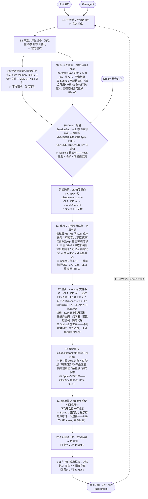

# ProductBacklog

按 SGEP 的四件套承诺关系组织：Product → Definition of Outcome Done，Increment → Definition of Output Done，Product Backlog → Product Goal。第四件（Sprint Backlog → Sprint Goal）属 Sprint 级，开 Sprint 时另建文件。

## 第一部分 · 产品、目标与完成定义

### 1. Product

> **claude-dream——一个 Claude Code 插件，为长期使用 Claude Code 的人提供可信的记忆离线整合（体检 → 整合 → 留证），使 agent 记忆免于腐烂，与用户和项目保持同步。**

*类型：按 SGEP 的 experience / platform 二分是 experience——直接面向用户解决一个具体问题，不是给别人搭产品的底座。满足缺口：长期使用下 agent 记忆会腐烂——自信引用过期事实，用户从此条条核实；官方离线整合零留证、禁碰 CLAUDE.md，且出过静默删除 23 个记忆文件的社区事故——缺的不是"会整合"，是"可信的整合"。势力范围：只动可维护记忆文件与 CLAUDE.md，绝不触碰其他项目内容（**2026-08-13 Sprint-2 Planning 裁定一次有意扩张**：新增底片层文件，落在 `.claude/` 专属目录，不进 `.claude/memory/`、不破 D2 契约，详见 PBI-01）。非目标：团队共享记忆、跨项目记忆、对话前端、模型推理。Stakeholders：见第三部分角色表。Scrum 角色映射：Product Owner＝seapawn；Product Developers＝Claude agent，增量一律经 PO 验收，sizing 归 Product Developers。*

### 2. Product Vision

> 任何长期使用 Claude Code 的人，开新会话时 agent 都像昨天刚一起工作过；而且越用越懂你——记忆产生复利，agent 能连起你自己都没连起的线索。

*Vision 常是尚未成真的虚构，作用是给假设与实验定方向，不是承诺。PO 决定（2026-08-09）：本产品不拆中期 Product Goal，Vision 直接兼任——Backlog 排序与每个 Sprint Goal 都直接对着它对齐。*

### 3. Definition of Done

两份完成定义，各挂一个工件，都是核对清单——每条是可二元判定的陈述：**Outcome Done 挂 Product**，答"价值何时算实现"，从首次发布起每次 Sprint Review 用真实使用证据检视，不必等产品全部交付；**Output Done 挂 Increment**，答"质量何时算合格"，每个增量交付前逐条过，不过即不算 Done。

#### Definition of Outcome Done

- [ ] OD1 **越用越懂**：agent 连起用户未明说的线索且被确认有用（connection 被采纳）——复利信号，须长期观察

*按 SGEP 在实现开始前定义、直接证据优先于间接证据；本条属长期观察项，非单次 Review 可判。其余候选（不引用过期事实、敢放行）待成熟版本后由 PO 再议补入。*

#### Definition of Output Done

- [ ] D1 **跑给你看**：每个增量都带一个能一键重跑的验证（脚本或步骤清单），当场重跑、全绿才算完
- [ ] D2 **不破坏官方 auto-memory 契约**：一记一文件 + MEMORY.md 纯指针索引，增量改动后契约完好
- [ ] D3 **过审才算完**：增量完成后必须经独立 review——调用 review agent 或 PO 亲审，通过才算 Done
- [ ] D4 **绿灯点过烟**：凡「拦坏事」的自动检查（安全阀/白名单/冷却/防递归等守卫，及需特殊状况才触发的分支），上岗前故意造一次它该拦的坏情况、亲眼看它红过一次——从没红过的绿灯可能只是坏事没来过；从没真正跑过的分支不算已覆盖。普通正向断言（错了自己会红）不受此限（2026-08-13 Sprint-1 Retro 增设，Sprint-2 Planning 收窄适用面）
- [ ] D5 **接口自述随增量交付**：增量的全部对外接口（命令形状、adapter 键名、占位符、旗标、环境变量、source 指向）一律在公开的交付接口约定中声明齐全，验收与后续消费者只依声明接线（2026-08-14 Sprint-2 增设；2026-08-15 refinement 拆分归位——原「打分保密」考卷侧半条与原 D6 移至下节「验收流程约定」）

*这是对每个增量、每条 PBI 通用的质量底线，Sprint 内不得削弱、只能加强。设计冲刺的 C1–C7 类条款（证据栏形态、抽查点、回滚行为、删除票……）是特定功能的验收标准，refinement 时归位到对应 PBI 的 Acceptance Criteria，不占用全增量的 DoD。*

### 4. 验收流程约定

*本节不是 DoD——DoD 挂 Increment、条条绑增量质量；本节约束的是验收考卷这件事本身。凡采用「出卷/答卷分离、卷面保密」的验收，出卷方必守（2026-08-15 refinement 自 DoD 原 D5/D6 归位；源自 Sprint-2 三轮接口脱靶教训，见 sprint-02-negatives/SprintBacklog 第五节）：*

1. **打分保密、接口不私藏**：只有「怎么打分」（判据表、场景、标记、夹具）留在保密卷；考卷不得使用公开交付接口约定之外的私藏接口。
2. **开考先自检**：考卷交付前必须先自检「是否消费了公开接口约定声明的全部接口（命令、键、旗标、环境变量、占位符）」——有声明未消费即报红，不许开考，防止把考卷自身脱靶伪装成答卷人缺陷反复打回。
3. **验收结论只看端到端主线**：验收结论由「PO 在场手操的端到端主线七站 + 第三方独立种植考场的实测」驱动；出卷方判分器（判据表/自动判分）退居幕后——可产出参考数据，不再单独驱动验收结论（2026-08-16 Sprint-3 裁定：AC 判分线收口作废，机器级判定归施工线 AI 环；出卷方的不可替代价值在第三方种植的独立证据）。
4. **第三方考场是自证之后的必经关口**：施工线 D1 自证全绿不构成验收依据——自证夹具口径随实现走，第三方独立种植的考场实测才能暴露口径偏差（Sprint-3 实证：自证 335/335 全绿、第三方考场 7 处红）。DoD 完整 ＝ 自证 ＋ 第三方考场实测。
5. **重要修复双线盲改对照**：端到端验收暴露的重要修复，默认施工线与出卷线双线独立施工 + 同一考场对照实测，PO 裁胜出版（2026-08-16 Sprint-3 实证：双盲对照直接分出两版质量高下，胜出版收口）。

## 第二部分 · Product Backlog

| 编号   | 标题                             | 产品意图                                                                              | 架构定位 | 当前状态                                                                                                                 | size | 备注（依据）                                                                                                                                                                                                                                                                                                                                                                                                    |
| ------ | -------------------------------- | ------------------------------------------------------------------------------------- | -------- | ------------------------------------------------------------------------------------------------------------------------ | ---- | --------------------------------------------------------------------------------------------------------------------------------------------------------------------------------------------------------------------------------------------------------------------------------------------------------------------------------------------------------------------------------------------------------------- |
| PBI-02 | 引擎主干产品化（纯机械梦切口） | 原型验证过的体检与处置能真装进 Claude Code 用 | S6–S7 | Sprint-3 施工完成（2026-08-15），待独立 review 与 PO 验收——拆条与 AC 见 sprint-03-engine/SprintBacklog.md 第二节 | L（切口后 Developers 估 6.5d，实测装下） | M1–M5 判据、L0/确凿删除/L3 处置、熔断器从脚本变插件形态（Sketches、verdict §2）；C2/C3 随本条作 AC；**G9 后半**（梦 D3 定向翻底片找用户留话）随本条；S1–S3/L1/L2 拆出为 PBI-07；**C1（单笔精撤）后置**，整梦全撤（Sprint-1 已交付）兜底 |
| PBI-07 | 引擎 LLM 层（L1 余项：合并/建 connection + L2 阀门管辖） | 机械层筛出的候选交给 LLM 判——记忆互矛盾裁决、记忆 vs CLAUDE.md 冲突、连接候选，引擎闭环「越用越懂」 | S6–S7 | 待精化（2026-08-15 Sprint-3 Planning 自 PBI-02 拆出） | M（待估） | 无证不理纪律（每项判断引双方原文出处）；S3 连接候选单梦限建 2 条（`max_new_connections` 配置键随本条引入）；**确凿删除已随 PBI-02 交付，本条 LLM 只能否决/标注/降级，不得新增删除票**；L2 走 `claude_md_edits` 阀门；`llm_checks: on` 档位随本条生效；隔离条目「连续两梦无翻案升候删」判定随本条；**C4（机器推论贴身份证：origin/confidence/generated_at/verified_at，未确认 connection 顶部警告）随本条交付**；C5 后半（提示行同源生成）随 PBI-05 |
| PBI-06 | 底片压缩复用成熟开源方案（重做） | 压缩链路不再自维护留/剔规则表，改复用成熟开源方案＋简单修改适配，降低格式漂移维护成本 | S4 | Planning 定案后置（2026-08-15）；底片消费契约已随 PBI-02 定为稳定公开接口（见 sprint-03-engine/SprintBacklog PBI-02.6-AC2，含台账结构/原话保留/用户发言段落标记三点），重做时必须保住 | 待估 | Sprint-2 验收暴露自建 RETAIN-RULES.md 覆盖缺口（agent-setting/relocated/worktree-state/file-history-delta 四类未覆盖，真实长会话 688 条 unknown、压缩比 5%→8.85%）。PO 判「自建路线很可能有问题」，倾向复用成熟开源方案＋简单修改而非自建。前置校验：候选方案须①覆盖官方最新类型（claude-code-log models.py 实测旧版、同样缺新类型）、②不引入安装税（Python 依赖等）、③不破「行为可审计」（渲染器≠审计器） |
| PBI-05 | 梦提示行送到用户眼前 | 用户不问也知道昨夜做过梦——知情的最后一米 | S9 | Planning 定案本轮不做（2026-08-15，连续第三轮未排）；下轮 refinement 再议 | S | H-A8：session-start 纯 stdout 只进 AI 上下文，用户看不见。修复方向已调研（`5c04dd3`）：hook JSON `systemMessage`（官方标注 shown to the user，SessionStart 下是否真渲染**待实测**，备选 `terminalSequence`）；冷却 0 值语义已由 developers 先行裁决支持；连续两轮议不搭车后，2026-08-15 refinement 依「S 码小活勿无限期漂」建议本轮搭车，但 Sprint-3 Planning 未采纳（PO 定主菜 PBI-02），连续第三轮未排；C5 后半（提示行同源生成）随本条精化时一并读入 |

*本表是达成 Product Goal 的唯一工作来源：行序即优先序，由 Product Owner 排定；编号是不随排序变的稳定 ID。**已交付条目不再列示（PO 裁定 2026-08-15）**：PBI-01（底片产线，Sprint-2）、PBI-03/04（缴械与骨架回环，Sprint-1）——档案见各 sprint 目录与 git 历史，编号永不复用。粗条目经 Refinement 拆小后写入对应 Sprint 的 SprintBacklog 第二节（层级编号如 PBI-06.1，AC/OC 须 PO 通过、sizing 归 Product Developers），本表对应行状态改「已精化」。依赖提示：PBI-02 的结构前提（canUseTool 缴械，原 PBI-03）已随 Sprint-1 交付在位；**底片消费契约已反转依赖方向**（见 sprint-03-engine/SprintBacklog PBI-02.6-AC2），PBI-02 不再等 PBI-06。入场条件：verdict §3 的 C1–C3 已裁（C1 后置、C2/C3 随 PBI-02，见该行备注）。**2026-08-15 Sprint-3 Planning 定案**：PBI-02（纯机械梦切口）为本轮主菜，LLM 层拆出新条目 PBI-07 接棒；PBI-06/PBI-05 本轮不做，后置候排。*

## 第三部分 · 架构

### 角色

| 角色       | 解释                                                            |
| ---------- | --------------------------------------------------------------- |
| 长期用户   | 产品的顾客：要 agent 像昨天刚一起工作过，且随时能推翻产品的改动 |
| 会话 agent | 记忆的生产者与消费者：会话中产生信号，开新会话时取用记忆        |

### 架构图

| 批注                                                                                                                                                        |
| ----------------------------------------------------------------------------------------------------------------------------------------------------------- |
| Dream 整合进程即产品自身——无人值守跑 S5–S9，人不参与梦，报告即汇报                                                                                       |
| 官方 auto-memory 契约是硬约束：一记一文件 + MEMORY.md 纯指针索引，不得破坏                                                                                  |
| 底片层（S4 产物）是硬约束的另一半：底片目录在梦的 canUseTool 白名单与梦前快照 pathspec 之外——梦对底片零写权、快照不吞底片（Sprint-2 落实，D4 点烟验证过） |
| 取用在架构上不被保证——记忆是 context，不是 enforced configuration，S11 只是最后一道拦截                                                                   |
| 记忆容器按工作目录路径字符串键控，项目改名/搬盘会静默孤立记忆（本项目 2026-07-29 实际发生过）                                                               |

*出处：数据流与角色取自 [.IDEO/design-sprint/DesignMap.md](.IDEO/design-sprint/DesignMap.md)；S5–S8 内部结构（触发、快照、判据、处置、阀门、报告六节）取自 [Sketches.md](.IDEO/design-sprint/Target-1-Consolidation/Prototype-01-FirstDream/Sketches.md) 定稿方案，完整论证与阀门配置回该文件查；实现状态标注综合 [TargetMap.md](.IDEO/design-sprint/Target-1-Consolidation/TargetMap.md)、[DesignReview.md](.IDEO/design-sprint/DesignReview.md) §5、§7 与 [verdict.md](.IDEO/design-sprint/Target-1-Consolidation/Prototype-01-FirstDream/verdict.md)；状态标注已于 2026-08-15 Sprint-2 收口后 refinement 刷新。*
