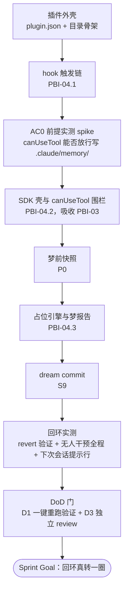

# Sprint-01-skeleton · SprintBacklog

## 第一节 · Sprint Goal

> **插件骨架立起，回环走通**——以 Claude Code 插件形态，无人值守完成一次「触发 → 梦前快照 → （占位）体检整合 → 梦报告 → git 提交 → 下次会话一行提示」的完整回环。引擎判得准不准本轮不管，环必须真转一圈。

## 第二节 · 选取条目与精化

### 选中条目（摘自 [ProductBacklog.md](../ProductBacklog.md) 第二部分）

| 编号 | 标题 | 产品意图 | 架构定位 | 当前状态 | size | 备注（依据） |
|---|---|---|---|---|---|---|
| PBI-03 | Agent SDK canUseTool 结构缴械 | 梦在结构上碰不到它不该碰的东西 | 横切 S5–S7 | Sprint-1 选定，已精化 | M | `.claude` 是受保护路径、headless 下 hook 不加载——从「推荐」升为「必选」；PBI-02 的前提（DesignReview §7、原型实测） |
| PBI-04 | 插件骨架与回环 | 插件形态立起来：无人值守转完一圈「触发→快照→占位整合→报告→提交→提示」，后续引擎内容有处可装 | S5 + P0 + S8 + S9（S6/S7 占位） | Sprint-1 选定，已精化 | L | 吸收 PBI-03（拉起梦必经 Agent SDK，canUseTool 围栏随壳就地装）；OC：环真转一圈，dream commit 可 revert |

### 精化（PBI-04 拆三条，04.2 吸收 PBI-03）

**PBI-04.1 触发链——梦该醒时醒**（含插件外壳）· size M
- AC1 插件本地安装后加载无报错
- AC2 会话正常结束后触发标记落盘（SessionEnd hook，零 API、零判断）
- AC3 冷却期内（默认 30 分钟，可配置）再结束会话，不重复触发
- AC4 梦进程自身结束不再触发（CLAUDE_INVOKED_BY 防递归，随 04.2·AC0 一并实测该环境变量在 Agent SDK 启动路径下确实可读）

**PBI-04.2 梦进程壳与围栏——梦只碰该碰的**（吸收 PBI-03）· size L（含前提验证，不确定性最高）
- AC0 **前提实测（spike，本条最先做）**：Agent SDK 起一次空跑，实测 canUseTool 在写入 `.claude/memory/` 时被调用且放行成功；若放行失败，退路为 `bypassPermissions` + git 快照审计（同原型做法），退路须记录在案，不允许静默降级
- AC1 分离进程判定条件满足后，经 Agent SDK 拉起梦进程
- AC2 canUseTool 白名单：仅 `.claude/memory/`、`.claude/dream/`、CLAUDE.md 可写；白名单内写入放行且全程零人工权限提示；越界写入被拒，且拒绝记录写入 `.claude/dream/<时间>-canUseTool.log`
- AC3 梦启动前完成 git 梦前快照（P0，pathspec 仅限上述三处）

**PBI-04.3 留证回环——梦留得下证**· size M
- AC1 占位引擎走完体检→整合过场（本轮不要求判得准）
- AC2 梦报告落 `.claude/dream/`，六节骨架在位（内容可为占位）
- AC3 记忆与 CLAUDE.md 改动收为单笔 `dream:` 前缀 commit，`git revert` 实测可退；报告文件是否同笔提交留待 C7 决定，本轮不预设、不写死
- AC4 下次会话开场出现一行提示
- AC5 **无人干预全程跑通**：从触发到提交一次运行完成，过程中不出现任何人工介入或权限提示——这是 Sprint Goal 本身的验证点

*size 已在本次 Sprint Planning 内由 Product Developer 自估（符合 ProductBacklog「Sprint Planning 时由 Product Developers 重估」的规则）；三条装不下时按行序退回，退回不伤 Sprint Goal 的最小成立（04.1+04.2 跑通即环有骨，04.3 是环合拢）。DoD 的 D1（一键重跑验证）与 D3（独立 review）不是单独工作项，是每条 AC 交付时随附的质量门——验证脚本随 04.1–04.3 各自产出，D3 在 Sprint 收尾时统一过审（见第三节 DoD 门节点）。*

## 第三节 · 计划

插件目录起在仓库内，位置开发时定，不复用已作废的旧 `claude-dream/`。
